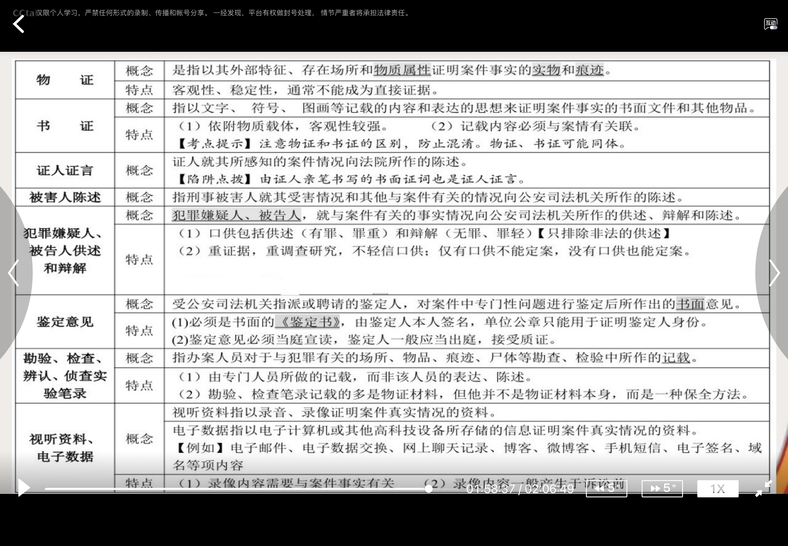
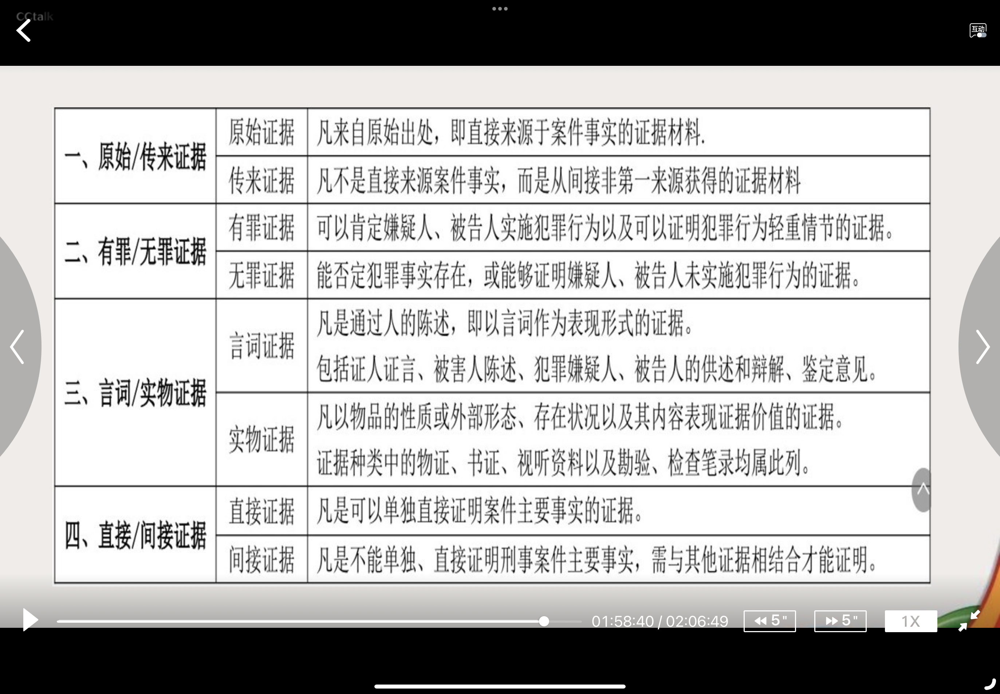

# 公安工作的基本方针和基本政策
## 公安工作的基本方针
#基本方针 #三懂四会
- 公安工作基本方针，是指我国各项公安业务工作都必须遵循的共同指导原则
- 基本方针
	- 党委领导下的专门机关与广大群众相结合
	- 关系：
		- 领导——党委
		- 结合——公安机关&人民群众的两个结合，公安机关主导地位
- 三懂四会群众工作方法
	- 三懂
		- 懂群众心理、懂群众语言、懂沟通技巧
	- 四会
		- 会化解矛盾、会调处纠纷、会主动服务、会宣传发动

## 公安工作的基本政策
#基本政策
### **严肃与谨慎相结合**
#基本政策/严肃与谨慎结合
- 严肃，就是执法必严；谨慎，就是重证据，重调查研究
- 总精神：不枉不纵 #不枉不纵
- 具体应用：稳、准、狠
	- 稳，就是要注意策略，讲究工作方法；不打无准备之仗，不打无把握之仗；要打得适时、有力；同时注意时间、地点、对象、节奏及宣传方法
	- 准，就是对打击对象一定要调查准确，不要出偏差，做到事实准、定性准、量刑准
	- 狠，就是要依法给犯罪分子以严厉打击，使之受到应有的惩处
### **依法从严从快惩处严重刑事犯罪分子的政策**
#基本政策/依法从严从快惩处严重刑事犯罪分子
- 依法从重从快惩处的对象是严重危害社会治安的犯罪分子
- 历史由来：这项重要的刑事政策是在1983年党和国家决定在全国范围内开展严厉打击刑事犯罪分子的斗争背景下形成的
- 含义：所谓依法从重，是依照《**刑法**》的规定，在量刑幅度以内从重处刑；所谓依法从快，是依照《**刑事诉讼法**》的规定，在审理案件的时限内迅速地审结案件
- 应注意的问题:
	1. 注意特定适用范围。依法从重从快惩处的对象是**严重危害社会治安的犯罪分子**;
	2. 必须坚持以事实为根据，以法律为准绳。从重从快不是不讲质量，而是要坚持做到事实清楚，证据确实充分，定性准确，量刑适当，程序合法。从重从快的前提是依法，要做到准确、及时、合法;
	3. 依法从重从快惩处严重刑事犯罪分子，并**不意味对其他刑事犯罪分子一律从宽或不予处罚。**
### **宽严相济的政策**
#基本政策/宽严相济
- 根据公安部的部署，加大对黑恶势力、严重暴力犯罪、经济犯罪、毒品犯罪，对发性涉财犯罪等五类犯罪的打击力度
- 定位:宽严相济政策，是党中央在建构社会主义和谐社会新形势下重申的一项重要政策，是我国基本刑事司法政策。
- 含义：宽严相济的“宽”，是指宽大、宽缓和宽待。主要表现为以下三种情形含义:
	- 一是**非犯罪化**，是指本来作为犯罪处理的行为，基于某种刑事政策的要求，不作为犯罪处理; #非犯罪化
	- 二是**非监禁化**，是指一些行为构成了犯罪，但根据犯罪情节和悔罪表现，判处非监禁刑或者采取缓刑、假释等非监禁的刑事处罚措施。 #非监禁化
	- 三是**非司法化**，针对诉讼程序而言，在一般情况下凡是涉嫌犯罪的都应进入刑事诉讼程序，但在公诉案件中，如果犯罪嫌疑人、被告人真诚悔罪，通过向被害人赔偿损失、赔礼道歉等方式获得被害人谅解，被害人自愿和解的双方当事人可以和解。非司法化，是对轻微犯罪案件在正式的刑事诉讼之外得以结案的一种方式，体现对轻微犯罪的宽缓处理。 #非司法化
- 宽严相济的“严”是指严格、严厉、严肃。
	- 严格是指法网严密、有罪必罚。
	- 严厉是指刑罚苛厉、从重惩处。
	- 严肃是指司法活动遵法而治、不狗私情。
- 宽严相济的“济”有三层含义:
	- 一是救济，以宽济严，以严济宽，
	- 二是协调，即宽严有度、宽严审势。
	- 三是并行，即宽中有严、严中有宽。
- 宽和严是有区别的，但是不同时期、不同犯罪和不同犯罪人，应当分别采取宽严不同的刑罚。 宽严相济刑事政策的实质是对刑事犯罪要区别对待，做到当严则严，当宽则宽，宽严适度，宽严有据，实现法律效果和社会效果的统一。
- 注意的问题
	1. 要突出“从严”依法从重从快严厉打击严重刑事犯罪和社会丑恶现象。长期坚持严打方针，维护社会稳定，保障经济发展。根据公安部的部署，加大对黑恶势力、严重暴力犯罪、经济犯罪、毒品犯罪，多发性涉财犯罪等五类犯罪的打击力度。
	2. 要突出“从宽” ，深入探索公安执法过程中的应对措施。
		1. 把好案件源头;(该立则立，不该立的不立)
		2. 推行刑事调解;(公安机关调解受害人与加害人对刑事案件的民事赔偿进行商谈)
	3.  慎用羁押性强制措施;(对主观恶性较小、犯罪情节轻微的未成年人初犯、偶犯、过失犯罪，贯彻“教育、感化、挽救”方针，符合条件的犯罪嫌疑人适用取保候审。
	4. 对未成年人、在校学生触犯轻罪实行**非刑事化**处理。
### **重证据，重调查研究，严禁逼供信的政策**
#证据 #调查 #基本政策/重证据，重调查研究，严禁逼供信的政策
- 废除肉刑和变相肉刑，禁止侮辱犯罪嫌疑人的人格尊严，废除一切法西斯式的审讯方式，给犯罪嫌疑人以人道的待遇
- (一) 基本要求
	 1. 要忠于事实真相，整个办案过程都要坚持以事实为根据:
	 2. 严禁逼供信，严禁以威胁、引诱、欺骗以及其他非法的方法收集证据;
	 3. 废除肉刑和变相肉刑，禁止侮辱犯罪嫌疑人的人格尊严，废除一切法西斯式的审讯方式，给犯罪嫌疑人以人道的待遇;
	 4. 凡有违犯者，必须从纪律上或法律上追究责任。
- (二)证据确实、充分，应当符合以下条件
	1. 定罪量刑的事实都有证据证明
	2. 据以定案的证据均经法定程序查证属实
	3. 综合全案证据，对所认定的事实已经排除合理怀疑
### **尊重和保障人权原则**
#基本政策/尊重和保障人权原则
- 尊重和保障人权是我国《宪法》确立的一项重要原则。正确处理打击犯罪和保障人权之间的关系，做到二者兼顾
### **教育与处罚相结合的政策**
#教育 #处罚 #基本政策/教育与处罚相结合
- 唯一的治安管理处罚原则。处罚是治安管理的必要手段，
- 教育是治安管理的基本手段
- 处罚是教育的辅助手段
- 对于违反治安管理的行为人，应当坚持：
	- 教育多数，出发少数，并且寓教育于处罚
- 基本要求
	- 以教为主，寓教于罚  教育是法制教育
	- 教育多数，处罚少数
	- 当罚则罚，罚如其分

# 证据
#证据
## 我国的证据种类
- 可以用手证明案件事实的材料，都是证据。公安机关办理行政案件的证据包括：
### （一)物证;
#证据/物证
- 概念
	- 是指以其外部特征、存在场所和物质属性证明案件事实的实物和痕迹。
- 特点
	- 客观性、稳定性，通常不能成为直接证据。
### (二)书证;
#证据/书证
- 概念
	- 指以文字、符号、图画等记载的内容和表达的思想水证明案件乎实的书面文件和其他物品。
- 特点
	- 依附物质载体，客观性较强。
	- 记载内容必须与案情有关联。
	- 【考点提示】注意物证和书证的区別，防止混淆。物证、书证可能同体。
### (三)被侵害人陈述和其他证人证言;
#证据/陈述 #证据/证言
- 证人证言
	- 证人就其所感知的案件情况向法院所作的陈述。
	- 【陷阱点拨】由证人亲笔书写的书面证词也是证人证言。
- 被害人陈述
	- 指刑事被書人就其受害情况和其他与案件有关的情况向公安司法机关所作的陈述。
### （四)违法嫌疑人的陈述和申辩
#证据/陈述 #证据/申辩
- 概念
	- 犯罪嫌疑人、被告人，就与染件有关的事实情况向公安司法机关所作的供述、辦解和陈述
- 特点
	- （1）口供包括供述《有罪、罪重）和辩解（无罪、罪轻）【只排除非法的供述
	- （2）重证据，重调查研究，不轻信口供：仅有口供不能定案，没有口供也能定案。
### (五)鉴定意见;
#证据/坚定意见
- 概念
	- 受公安司法机关指派或聘请的鉴定人，对案件中专门性问题进行签定后所作出的书面意见。
- 特点
	1. 必须是书面的《签定书，由鉴定人本人签名，单位公章只能用于证明鉴定人身份
	2. 鉴定意见必须当庭宣读，鉴定人一般应当出庭，接受质证。
### (六)勘验、检查、辨认笔录，现场笔录;
#证据/勘验 #证据/检查 #证据/辨认笔录 #证据/现场笔录 #证据/笔录
- 概念
	- 指办案人员对子与犯罪有关的场所、物品、痕迹、尸体等勘查、检验中所作的记载。
- 特点
	- （1）由专门人员所做的记载，而非该人员的表达、陈述。
	- (2）勘验、检查笔录记载的多是物证材料，但他并不是物证材料本身，而是一种保全方法。
### （七)视听资料、电子数据。
#证据/试听资料 #证据/电子数据
- 概念
	- 视听资料指以录音、录像证明案件真实情況的资料。
	- 电子数据指以电子计算机或其他高科技设备所存储的信息证明案件真实情况的资料。【例如】电子邮件、电子数据交换、网上聊天记录、博客、微博客、手机短信、电子签名、域名等项内容
- 特点
	- 录像内容需要与案件事实有关
	- 录像内容一般产生于诉讼前
证据必须经过查证属实，才能作为定案的根据。

## 非法证据排除
- 严禁刑讯逼供和以威胁、欺骗等非法方法收集证据。
- 采用刑讯逼供等非法方法收集的违法嫌疑人的陈述和申辩以及采用暴力、威胁等非法方法收集的被侵害人陈述、其他证人证言，不能作为定案的根据。
- 收集物证、书证不符合法定程序，可能严重影响执法公正的，应当予以补正或者作出合理解释;不能补正或者作出合理解释的，不能作为定案的根据。
## 调取证据程序
1. 公安机关向有关单位和个人收集、调取证据时，应当告知其必须如实提供证据，并告知其伪造、隐匿、毁灭证据，提供虚假证词应当承担的法律责任。
2. 需要向有关单位和个人调取证据的，经公安机关办案部门负责人批准，开具调取证据通知书，明确调取的证据和提供时限。被调取人应当在通知书上盖章或者签名，被调取人拒绝的，公安机关应当注明。必要时，公安机关应当采用录音、录像等方式固定证据内容及取证过程。
3. 需要向有关单位紧急调取证据的，公安机关可以在电话告知人民警察身份的同时，将调取证据通知书连同办案人民警察的人民警察证复印件通过传真、互联网通讯工具等方式送达有关单位。
## 调取证据要求
- ①物证
	- 收集调取的物证应当是原物。在原物不便搬运、不易保存或者依法应当由有关部门保管、处理或者依法应当返还时，可以拍摄或者制作足以反映原物外形或者内容的照片、录像。物证的照片、录像，经与原物核实无误或者经鉴定证明为真实的，可以作为证据使用。
- ②书证
	- 收集、调取的书证应当是原件。在取得原件确有困难时，可以使用副本或者复制件。书证的副本、复制件，经与原件核实无误或者经鉴定证明为真实的，可以作为证据使用。书证有更改或者更改迹象不能作出合理解释的，或者书证的副本、复制件不能反映书证原件及其内容的，不能作为证据使用。
- ③电子数据
	- 收集电子数据，能够扣押电子数据原始存储介质的，应当扣押，无法扣押原始存储介质的，可以提取电子数据。提取电子数据，应当制作笔录，并附电子数据清单，由办案人民警察、电子数据持有人签名。持有人无法或者拒绝签名的，应当在笔录中注明。由于客观原因无法或者不宜依照前两款规定收集电子数据的，可以采取打印、拍照或者录像等方式固定相关证据，并附有关原因、过程等情况的文字说明，由办案人民警察、电子数据持有人签名。持有人无法或者拒绝签名的，应当注明情况。
## 证人
#证据/证人
-  凡知道案件情況的人，都有作証的必条。
- 生理上、精神上有缺陷或者年幼，不能辦别是非、不能正确表达的人，不能作为证人。

## 分类

### 原始/传来证据
#证据/原始传来证据
- 原始证据：凡是来自原始出处，即直接来源于案件事实的证据材料
- 传来证据：凡不是直接来源案件事实，而是从间接非第一来源获得的证据材料
### 有罪/无罪证据
#证据/有罪无罪证据
- 有罪证据：可以肯定嫌疑人、被告人实施犯罪
- 无罪证据：能否定犯罪事实存在，或能够证明嫌疑人、被告人未实施犯罪行为的证据
### 言词/实物证据
#证据/言词实物证据
- 言词证据：凡是通过人的陈述，即以言词作为表现形式的证据。包括证人证言、被害人陈述、犯罪嫌疑人、被告人的供述和辩解、鉴定意见
- 实物证据：凡以物品的性质货外部形态、存在状态以及内容表现证据价值的证据。证据种类中的物证、书证、视听资料以及勘验、检查笔录均属此列
### 直接/间接证据
#证据/直接间接证据
- 直接证据：凡是可以单独直接证明案件主要事实的证据
- 间接证据：凡是不能单独、直接证明刑事案件主要内容，需与其他证据相结合才能证明

