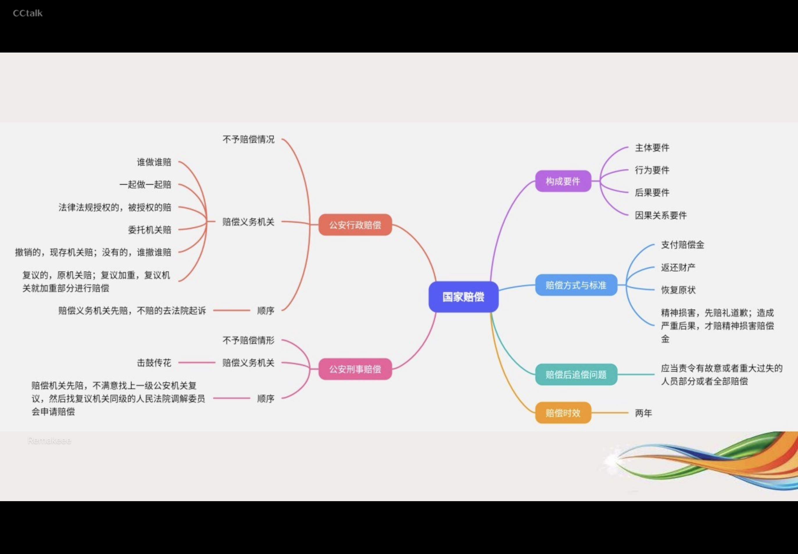
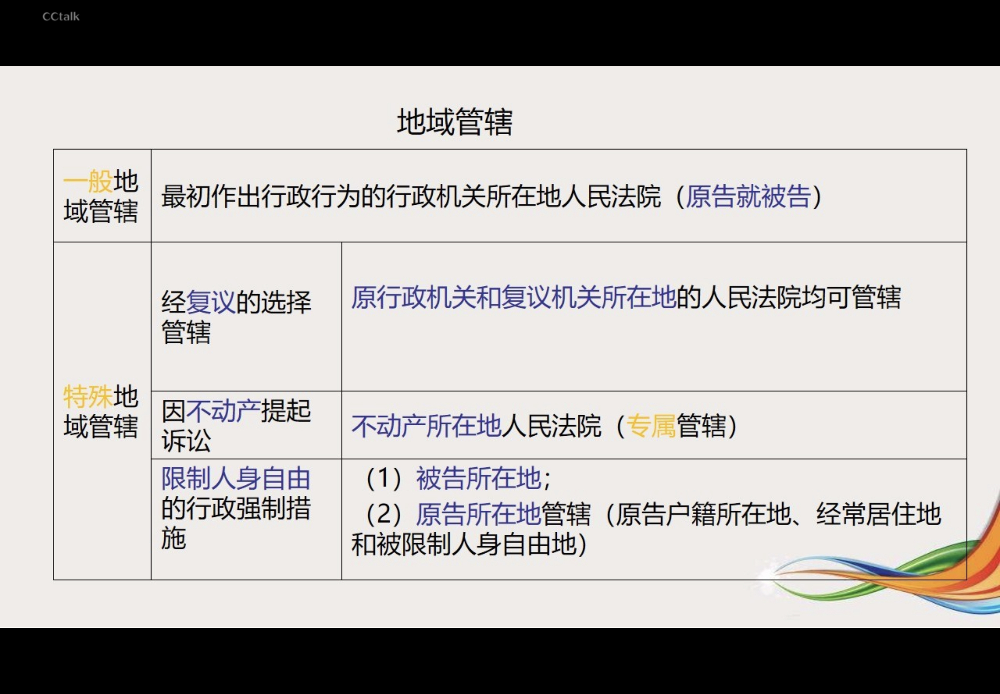

---

mindmap-plugin: basic

---
# 概述
1. 概念和特征
公安执法监督，是指法律授权的机关以及公民和社会组织对公安机关及其人民警察依法履行职责、行使职权的活动和遵守纪律的情况所实施的监督。

公安执法监督有以下基本特征：
- （一）监督对象的特定性
	- 公安执法监督的对象是公安机关及其人民警察。
- (二）监督主体的广泛性
- (三）监督形式的多样性
- （四）监督过程的程序性

2. 监督的分类
	1. 监督的主体
		1. 国家权力机关的监督
		2. 检察机关的监督
		3. 审判机关的监督
		4. 监察机关的监督
		5. 公安机关内部监督
		6. 社会的监督

	1. 隶属关系
		1. 外部监督
			1. 国家权力机关的监督
			2. 监察监督
			3. 检察监督
			4. 行政诉讼监督
			5. 社会监督等
		2. 内部监督
			1. 督查监督
			2. 法制部门监督
			3. 行政复议
			4. 国家赔偿监督

	2. 监督的时间
		1. 事前监督
		2. 事中监督
		3. 事后监督

	1. 法律效力
		1. 直接监督
		2. 间接监督

# 公安机关内部执法监督
## 督察机构
### 督查机构的组织结构
- 设立部门：
	- 公安部
	- 县级以上地方各级人民政府的公安机关
- 领导机构
	- 全国公安机关督查工作的领导者：公安部督查委员会
- 负责体制
	- 公安部督查委员会对公安部部长负责；
	- 县级以上地方各级人民政府的公安机关督察机构对上一级公安机关督察机构和本职公安机关行政首长负责
	- 所有的督察机构均由专职人员组成
- 领导设置
	- 公安部设督察长，由公安部一名副职领导成员担任
	- 县级以上地方各级人民政府公安机关设督察长，由公安机关行政首长兼任
### 督察机构权限
1. 派出督查权被指令督察权
	1. 督察机构可以向本级公安机关所属单位和下级公安机关派出督察人员进行督察，也可以指令下级公安机关督察机构对专门事项进行督察。
2. 警务参与权
	1. 督察机构可以派出督察人员参加本级公安机关或者下级公安机关的警务工作会议和重大警务活动的部署。
3. 责令执行权 
	1. 督察机构对本级公安机关所属单位和下级公安机关拒不执行法律、 法规和上级决定、命令的，可以责令执行;
4. 决定撤销或变更权
	1. 对本级公安机关所属单位或者下级公安机关作出的错误决定、命令，可以决定撒销或者变更，报本级公安机关行政首长批准后执行。
5. 违法违纪查处权
	1. 查处民警违法违纪行为
6. 当场处置权
	1. 督察人员在现场督察中发现公安机关人民警察违法违纪的，可以米取下列措施，当场处置：
		1. 对违反警容风纪规定的，可以当场子以纠正；
		2. 对违反规定使用武器、警械以及警用车辆、警用标志的，可以扣留其武器、警械、警用车辆、警用标志：
		3. 对违法违纪情节严重、影响恶劣的，以及拒绝、阻碍督察人员执行现场督察工作任务的，必要时，可以带离现场。
7. 实施停止执行职务和禁闭权
	1. 督察机构认为公安机关人民警察违反纪律需要采取停止执行职务、禁闭措施的，由督察机构作出决定，报本级公安机关督察长批准后执行。停止执行职务的期限为10日以上60日以下：禁闭的期限为 1日以上7日以下。
	2. 公安机关人民警察对停止执行职务和禁闲決定不服的，可以在被停止执行职务或者被禁闲期间向作出决定的公安机关的上一级公安机关提出申诉。受理申诉的公安机关对不服停止执行职务的申诉，应当自收到申诉之日起5日内作出是否撤销停止执行职务的決定
	3. 对不服禁闭的申诉，应当在收到申诉之时起24 小时内作出是否撤销禁闭的决定。申诉期间，停止执行职务、禁闭决定不停止执行。
8. 移送处理权
	1. 督察机构认为公安机关人民警察需要给子处分或者降低警街、取消警街的，督察机构应当提出建议，移送有关部门依法处理。督察机构在督察工作中发现公安机关人民警察涉嫌犯罪的，移送司法机关依法处理。

## 法制部门的监督
- 法治部门的设立
	- 各级公容机关的法制部门是公安机关内部执法监督玉作的主管部门，在本级公安关的领导下，负责组织、实施、协调、指导执法监督工作。  县级以上公安机关应当设立专门法制机构。
- 法治部门监察的范围
	- 对公安机关的执法活动进行监督
- 执法监督的方式
	- (1)依照法律、法规和规章规定的执法程序和制度进行监督：
	- (2)对起草、制定的有关执法工作的规范性文件及制度、措施进行法律审核；
	- （3)对疑难、有分歧、易出问题和各级公安机关決定需要专门监督的茶件，进行**案件审核**;
	- （4)**组织执法检查、评议**;
	- （5)**组织专项、专茶调查;**
	- (6)依照法律、 法规进行**听证、复议、复核**;
	- (7）进行**执法过错责任追究**;
	- (8)各级公安机关决定采取的其他方式。
- 执法监督的权限
	1. 错误的处理或者決定：撤销或者变更
	2. 拒不履行法定职责：责令其在规定的时限内履行法定职责。
	3. 拒不执行上级公安机关決定和命令：可以停止执行职务；
	4. 国家赔偿；
	5. 因故意或者过失，造成执法过错的，按照《公安机关人民警察执法过错责任追究规定》追究执法过错责任。

## 公安行政复议制度
1. 概念
	1. 公安行政复议制度，是指公民、法人或者其他组织认为公安机关的具体行政行为侵犯其合法权益，依法提出申请，由受理的公安机关对该具体行政行为进行审查和决定的法律制度
2. 复议部门
	1. 上级公安机关或同级人民政府。（原则）
	2. 派出所复议：
		1. ①幅度越权（警告和伍佰元以下罚款）：应当向派出它的区、县公安局申请行政复议，也可以向该区、县人民政府申请行政复议;
		2. ②种类越权：当向派出它的区、县公安局的上一级公安机关（市局）申请行政复议，也可以向该区、县人民政府申请行政复议
3. 复议范围
	1. 公民，法人或者其他组织对公安机关的下列具体行政行为不服的，可以提起行政复议：
		1. (1)对公安机关作出警告、罚款、没收违法所得、没收非法财物、责令停产停业、暂扣或者吊销执照、行政拘留等行政处罚不服的；
		2. (2)对公安机关作出的限制人身自由或者查封、扣押、冻结财产等行政强制措施决定不服的;
		3. (3)对公安机关作出的有关许可证、执照、资质证、资格证等证书变更、中止、撤销的决定不服的;
		4. (4)认为公安机关侵犯其合法的经营自主杖的;
		5. (5)认为公安机关违法集资、征收财物、摊派费用或者违法要求履行其他义务的：
		6. (6)认为符合法定条件，申请公安机关领发许可证、执照、资质证、资格证等证书，或者申请公安机关审批、登记有关事项，公安机关没有依法办理的;
		7. （7)申请公安机关履行保护人身权利、财产权利的法定职责，公安机关没有依法履行的;
		8. (8)认为公安机关的其他具体行政行为侵犯其合法权益的。
4. 不予受理范围
	1. ①不服公安机关作出的行政处分或者其他人事处理決定;
	2. ②不服公安机关对民事纠纷作出的调解或者其他处理的：
	3. ③公安机关作出的刑事司法行为不子复议；
	4. ④公安机关作出的没有法律强制约束力的行为
	5. 鉴定结论不能复议
		1. 对处理火灾事故、交通事故以及办理其他行政案件中作出的鉴定结论等不服的，不属于公安机关行政复议范围
		2. 可以重新鉴定

- 申请主体
	- 依照行政复议法申请行政复议的公民、法人或者其他组织是申请人。有权申请行政复议的公民死亡的，其近亲属可以申请行政复议。有权申请行政复议的公民为无民事行为能力人或者限制民事行为能力人的，其法定代理人可以代为申请行政复议。有权申请行政复议的法人或者其他组织终止的，承受其权利的法人或者其他组织可以申请行政复议。同申请行政复议的具体行政行为有利害关系的其他公民、法人或者其他组织，可以作为第三人参加行政复议。
- 被申请人
	- 公民、法人或者其他组织对行政机关的具体行政行为不服申请行政复议的，作出具体行政行为的行政机关是被申请人。
- 申请方式
	- 申请人申请行政复议，可以书面申请，也可以口头申请；口头申请的，行政复议机关应当当场记录申请人的基本情况、行政复议请求、申请行攻复议的主要事实、理由和时间。
- 费用
	- 行政复议机关受理行政复议申请，不得向申请人收取任何费用。行政复议活动所需经费，应当列入本机关的行政经费，由本级财政予以保障。
- 期限
	- 申请期限
		- 公民、法人或者其他组织认为具体行政行为侵犯其合法权益的，可以自知道该具体行政行为之日起**六十日**内提出行政复议申请；但是法律规定的申请期限超过六十日的除外。因不可抗力或者其他正当理由耽误法定申请期限的，申请期限自障碍消除之日起继续计算。
	- 决定期限
		- 行政复议机关应当自受理中请之日起**六十日**内作出行政复议决定；但是法律规定的行政复议期限少于六十日的除外。情况复杂，不能在规定期限内作出行政复议决定的，经行政复议机关的负责人批准，可以适当延长，并告知申请人和被申请人：但**是延长期限最多不超过三十日**。行政复议机关作出行政复议决定，应当制作行政复议决定书，并加盖印章。行政复议决定书一经送达，即发生法律效力。

## 公安赔偿制度
1. 概念
	1. 是指公安机关及其人民警察行使职权侵犯公民、法人和其他组织的合法权益并造成损害时，由国家承担赔偿的法律制度。
2. 构成要件
	1. 主体要件。构成公安赔偿，即必须是公安机关及其人民警察，非公安机关和人民警察的职务行为不能引起公安赔偿。
	2. ◎行为要件。《国家赔偿法》确立了国家赔笑的归责原则为违法原则，同时兼有结果规则、过错归责。合法的行使职权的行为，即使造成损害，也不会产生国家赔偿责任。
	3. 后果要件。公安赔偿，以造成公民、法人和其他组织合法权益的损害后果为必要条件。损害必须是客观上已经发生的对人身权、财产权的损害，而不包括可能造成的损害和仅仅造成危险的情况。
	4. 因果关系要件。构成公安赔偿，还要求公安机关及其人民警察违法行使职权的行为与损害后果之间心须存在因果关系。
### 公安行政赔偿
- 是指公安机关及其人民警察违法行使行政职权，侵犯公民、法人和其他组织合法权益造成损害的，由国家承担的赔偿。
- 公安机关行政赔偿的情形：
	- ◎人身权赔偿；
	- ②财产权赔偿。
- 国家不承担赔偿责任的情形：
	- ⑨公安机关人民警察的纯粹个人行为；
	- ②公民、法人和其他组织白己的行为致使损害发生;
	- ③法律规定的其他情况。

### 公安刑事赔偿  
- 是指公安机关及其人民警察违法行使侦查职权，侵犯公民、法人和其他组织合法权益造成损害的，由国家承担的赔偿。
- 公安刑事赔偿的情形：⑨人身权赔偿;②财产权赔偿。
- 根据《国家赔偿法》 第十九条规定，属于下列情形之一的，国家不承担赔偿责任：
1.因公民自己故意作虚伪供述，或者份造其他有罪证据被羁押或者被判处刑罚的；
2,依照刑法第十七条、第十八条规定不负刑事责任的人被羁押的;
3依照刑事诉讼法第十五条、第一百七十三条第二款、第二百七十三条第二款、第二百七十九条规定不追究刑事责任的人被羁押的；
4行使侦查、检察、审判职权的机关以及看守所、监狱管理机关的工作人员与行使职权无关的个人行为；
5因公民自伤、自残等故意行为致使损害发生的；
6法律规定的其他情形。

### 公安赔偿的方式和标准
- 公安赔偿的方式包括：
	- ②支付赠偿金；
	- ②返还财产；
	- ③恢复原状。
	- 国家赔偿的方式以 前者为主，以后两者为辅。
	- 另外，这三种方式可单独适用，也可在某些情况下并用。这主要是针对财产权受损害的赔偿方式。
- 《国家赔偿法》 第35条规定，赔偿义务机关的行为致人精神损害的，应当在侵权行为影响的范国内，为受害人消除影响，恢复名誉，赔礼道歉；造成严重后果的，应当支付相应的精神损害赔偿。

### 赔偿义务机关-刑事
- 行使侦查、检察、审判职权的机关以及看守所、监狱管理机关及其工作人员在行使职权时侵犯公民、法人和其他组织的合法权益造成损害的，该机关为赔偿义务机关。
- 对公民采取拘留措施，依照本法的规定应当给子国家赔偿的，作出拘留决定的机关为赔偿义务机关。
- 对公民采取逮捕措施后决定撤销案件、不起诉或者判决宣告无罪的，作出逮捕决定的机关为赔供义务机关。
- 再审改判无罪的，作出原生效判决的人民法院为赔供义务机关。二审改判无罪，以及二审发回重审后作无罪处理的，作出一审有罪判决的人民法院为赔供义务机关。

### 赔偿义务机关-行政
1. 行政机关及其工作人员行使行政职权侵犯公民、法人和其他组织的合法权益造成损害的，该行政机关为赔偿义务机关。
2. 两个以上行政机关共同行使行政职权时侵犯公民、法人和其他组织的合法杈益造成损書的，共同行使行政职权的行政机关为共同赔偿义务机关。
3. 法律、法规授权的组织在行使授子的行政权力时侵犯公民、法人和其他组织的合法权益造成损書的，被授权的组织为赔偿义务机关。
4. 受行政机关委托的组织或者个人在行使受委托的行政权力时侵犯公民、法人和其他组织的合法权益造成损害的，委托的行政机关为赔偿义务机关。
5. 赔偿义务机关被撤销的，继续行使其职权的行政机关为赔偿义务机关；没有继续行使其职权的行政机关的，撤销该赔偿义务机关的行政机关为赔偿义务机关
6. 经复议机关复议的，最初造成侵权行为的行政机关为赔偿机关，但复议机关的复议决定加重损害的，复议机关对加重的部分履行

### 赔偿义务赔偿时效问题

- 赔偿请求人请求国家赔偿的时效为**两年**，自其知道或者应当知道国家机关及其工作人员行使职权时的行为侵犯其人身权、财产权之日起计算，但**被羁押等限制人身自由期问不计算在内**。在申请行政复议或者提起行政诉讼时一并提出赔偿请求的，适用行政复议法、行政诉讼法有关时效的规定。赔偿请求人在赔偿请求时效的最后六个月内，因不可抗力或者其他障碍不能行使请求权的，时效中止。从中止时效的原因消除之日起，赔偿请求时效期间继续计算。（《国家赔偿法》第三十九条）

### 国家赔偿的顺序
- 赔偿请求人要求赔偿，应当先向赔偿义务机关提出

#### 行政赔偿程序
- 赔偿义务机关应当自收到申请之日起两个月内，作出是否赔偿的决定。赔偿义务机关决定赔偿的，应当制作赔偿决定书，并自作出決定之日起十日内送达赔偿请求人。赔偿义务机关决定不子赔偿的，应当自作出决定之日起十日内书面通知赔偿请求人，并说明不予赔偿的理由。
- 赔偿义务机关在规定期限内未作出是否赔偿的决定，赔偿请求人可以自期限届满之日起三个月内，向人民法院提起诉讼。赔偿请求人对赔偿的方式、项目、数额有异议的，或者赔偿义务机关作出不予赔偿决定的，赔偿请求人可以自赔偿义务机关作出赔偿或者不子赔偿决定之日起三个月内，向人民法院提起诉讼。

#### 刑事赔偿顺序
- 赔偿义务机关应当自收到申请之日起两个月内，作出是否赔偿的决定。赔偿义务机关决定赔偿的，应当制作赔偿決定书，并自作出决定之日起十日内送达赔偿请求人。赔偿义务机关决定不予赔偿的，应当自作出决定之日起十日内书面通知赔偿请求人，并说明不予赔偿的理由。
- 赔偿义务机关在规定期限内末作出是否赔偿的决定，赔偿请求人可以自期限届满之日起三十日内向赔偿义务机关的上一级机关申请复议。赔偿请求人对赔偿的方式、项目、数额有异议的，或者赔偿义务机关作出不子赔偿决定的，赔偿请求人可以自赔偿义务机关作出赔偿或者不子赔偿決定之日起三十日内，向赔偿义务机关的上一级机关申请复议。赔偿义务机关是人民法院的，赔偿请求人可以依照本条规定向其上一级人民法院赔偿委员会申请作出赔偿决定。
- 复议机关应当自收到申请之日起两个月内作出决定。赔偿请求人不服复议决定的，可以在收到复议决定之日起三十日内向**复议机关所在地的同级人民法院赔偿委员会**申请作出赔偿决定；复议机关逾期不作决定的，賠偿请求人可以自期限届满之日起三十日内向复议机关所在地的同级人民法院赔偿委员会申请作出赔偿决定。

### 公安机关办理国家赔偿案件程序规定
- 二十七条
	- 侵犯公民人身自由的每日赔偿金，按照做出决定时的国家上年度职工日平均工资计算
	- 作出决定时国家上年度职工日平均工资尚未公布的，以公布的最近年度 职工日平均工资为准

# 公安机关外部执法监督
-tx-
|:---|:---|:---|:---
|形式|主体|性质|依据|
|国家权力机关监督|各级人民代表大会及其常务委员会|国家监督|宪法和法律|
|监察监督|监察委员会|监察监督|国家监察法|
|检察监督|人民监察院|法律监督|刑事诉讼法|
|行政诉讼|人民法院|司法监督|行政诉讼法|
|社会监督|人民政协、社会组织、公民、社会舆论|非国家性质监督|宪法和有关法律，人民的权利|

## 国家监督权实现的途径
国家权力机关对公安机关及其人民警察的监督，主要通过以下途径实现
- 其一，制定相应法律、法规对公安机关及其人民警察行使职权的活动进行制约；
- 其二，对各级政府制定的有关公安工作经费的预算、决算进行审查，做出批准与否的决定；
- 其三，依法改变、撒销受监督机关制定或批准的不适当的法律、法规、决定和命令；
- 其四，听取公安机关关于法律实施情况的报告，对法律实施的情况进行检查，有权要求公安机关进行汇报，提出批评、意见、建议或者做出決定；
- 其五，对公安工作中的违法违纪行为提出议案，要求公安机关报告有关情况，改正错误的、不适当的行为；
- 其六，县级以上各级人大常委会，享有受理人民群众对公安机关及其人民警察提出的申诉和意见的监督权。

## 监察机关的监督
- （一)对公职人员开展廉政教育，对其依法履职、秉公用权、廉洁从政从业以及道德操守情况进行监督检查；
- （二)对涉嫌贪污贿赂、滥用职权、玩忽职守、权力寻租、利益输送、徇私舞弊以及浪费国家资财等职务违法和职务犯罪进行调查；
- （三)对违法的公职人员依法作出政务处分决定；对履行职责不力、失职失责的领导人员进行问责；对涉嫌职务犯罪的，将调查结果移送人民检察院依法审查、提起公诉；向监察对象所在单位提出监察建议。

## 检察监督
人民检察院实施法律监督的主要内容及形式：
- （1）立案监督;
	- 立案监督的形式是要求公安机关说明不立案的理由和通知公安机关立案，人民检察院认为公安机关对应当立案而不立案侦查的案件，或者被害人认为公安机关对应当立案而不立案侦查的案件向人民检察院提出的，人民检察院应当要求公安机关说明不立案的理由;人民检察院认为公安机关不立案理由不能成立的，应当通知公安机关立案，公安机关按到通知后应当立案。
- （2）审查批捕;
	- 人民检察院通过行使审查批准逮捕权，依法作出批准逮捕或者不批准逮捕的决定，对公安机关的侦查活动实施法律监督。
- (3）审查起诉；
	- 申查起诉，是指人民检察院依法对公安机关侦查终结移送起诉的案件进行申查，依法作出提起公诉或不起诉决定的活动。
	- 人民检察院审查起诉的主要内容有：犯罪事实、情节是否清楚，证据是否确实、充分，犯罪性质和罪名的认定是否正确；有无遗漏罪行和其他应当追究刑事责任的人;是否属于不应追究刑事责任的;有无附带民事诉讼；侦查活动是否合法。人民检察院应当按照法定程序和期限审查起诉，并根据起诉的条件分别作出提起公诉或不起诉的决定，对于犯罪事实不清、证据不足的案件，有权退回公安机关补充侦查。
- (4） 侦查活动的合法性监督；
	- 监督的内容主要是发现和纠正以下违法行为：对犯罪嫌疑人刑讯逼供、诱供的；对被害人、证人以体罚、威胁、诱骗等非法手段收集证据的；份造、隐匿、销毁、偷换或者私自涂改证据的；徇私舞弊，放纵、包庇犯罪分子的；故意制造冤 假、错案的；在侦查活动中利用职务之便谋取非法利益的；在侦查活动中不应当撤案而撒案的；贪污、挪用、调换所扣押、 冻结的款物及其攀息的；违反刑事诉讼法关于决定、执行、变更、撒销强制措施规定的；违反羁押和力案期限规定的；在侦查中有其他违反刑事诉讼法有关规定的行为的。
	- 对公安机关侦查活动中的违法行为，人民检察院有权根据情节和后果，分别采用口头、书面形式提出纠正意见。对人民检察院发出纠正违法的口头通知或纠正违法通知书的，公安机关应当及时纠正，并将纠正情况及时通知人民检察院
- （5）执行监督
- （6）参与行政诉讼
- （7）受理控告、举报

## 行政诉讼
- 行政诉讼
	- 以审查合法性为主
	- 以审查合理性为例外
- 行政复议
	- 既审查合法性 又审查合理性

＞是指人民法院通过依法行使行政申判权对行政机关（包括公安机关）行政行为的合法性进行审查并作出裁決，以促使行政机关依法行政，保护公民 法人和其他组织合法权益的法律制度。

＞依法不子受理的情形：
公民、 法人和其他组织对下列事项提起的诉讼，人民法院不子受理：
(1)/国防、外交等国家行为。
(2)行政法规、规章或者行政机关制定、发布的具有普遍约束力的决定、命令。
(3)行政机关对行政机关工作人员的奖惩、任免等决定。
（4)法律规定由行政机关最终裁决的具体行政行为。
（5）公安机关作出的刑事司法行为
（6）公安机关作出没有法律约束力的行为
### 地域管辖
- 一般地域管辖
	- 最初作出行政行为的行政机关所在地人民法院（原告就被告）
- 特殊地域管辖
	- 经复议的选择管辖 
		- 原行政机关和复议机关所在地的人民法院均可管辖
	- 因不动产提起诉讼
		- 不动产所在地的人民法院（专属）
	- 限制人身自由的行政强制措施
		- 被告所在地
		- 原告所在地管辖（原告户籍所在地、经常居住地和被限制人身自由地）

1. 行政案件由最初作出行政行为的行政机关所在地人民法院管辖。经复议的案件，也可以由复议机关所在地人民法院管辖。经最高人民法院批准，高级人民法院可以根据审判工作的实际情况，确定若干人民法院跨行政区域管辖行政案件。
2. 对限制人身白由的行政理制措施不服提起的诉讼，由被传所在地成者原告所在地人民法院管辖。
3. 因不动产提起的行政诉讼，由不动产所在地人民法院管辖。
4. 两个以上人民法院都有管辖权的案件，原告可以选择其中一个人民法院提起诉讼。原告向两个以上有管辖权的人民法院提起诉讼的，由最先立案的人民法院管辖。

#### 级别管辖
- 基层法院
	- 第一审行政案件
- 中级人民法院
	- 海关处理的案件
	- 对国务院部门或者县级以上地方人民政府所作的行政行为提起诉讼的案件
	- 本辖区内的重大、复杂案件
	- 其他法律规定由中级人民法院管辖的案件
- 高级人民法院
	- 本辖区内重大、复杂的第一审行政案件
- 最高人民法院
	- 本辖区内重大、复杂的第一审行政案件

-tx-
|:---|:---
|基层人民法院|第一审行政案件|
|中级人民法院|海关处理的案件|\
||对国务院部门或者县级以上地方人民政府所作的行政行为提起诉讼的案件|\
||本辖区内的重大、复杂案件|\
||其他法律规定由中级人民法院管辖的案件|
|||
|高级人民法院|本辖区内重大、复杂的第一审行政案件|
|最高人民法院|本辖区内重大、复杂的第一审行政案件|

### 证据规则
1. 被告对作出的行政行为负有举证责任，应当提供作出该行收行为的证据和所依据的规范性文件。被告不提供或者无正当理由逾期提供证据，视为没有相应证据。但是，被诉行政行为涉及第三人合法权益，第三人提供证据的除外。
2. 在诉讼过程中，被告及其诉讼代理人不得自行向原告、第三人和证人收集证据。
3. 原告可以提供证明行政行为违法的证据。原告提供的证据不成立的，不免除被告的举证责任。
4. 在起诉被告不履行法定职责的案件中，原告应当提供其向被告提出申请的证据。但有下列情形之一的除外：
	- (一被告应当依职权主动履行法定职责的；
	- (二)原告因正当理由不能提供证据的。
- 在行政赔偿、补偿的案件中，原告应当对行政行为造成的损害提供证据。因被告的原因导致原告无法举证的，由被告承担举证责任。

#### 被告
- 法人或者其他组织直接向人民法院提起诉讼的，作出行政行为的行政机关是被告。
- 经复议的案件，复议机关决定维持原行政行为的，作出原行政行为的行政机关和复议机关是共同被告;复议机关改变原行政行为的，复议机关是被告。
- 复议机关在法定期限内未作出复议决定，公民、法人或者其他组织起诉原行政行为的，作出原行政行为的行政机关是被告;起诉复议机关不作为的，复议机关是被告。
- 两个以上行政机关作出同一行政行为的，共同作出行政行为的行政机关是共同被告。
- 行政机关委托的组织所作的行政行为，委托的行政机关是被告。
- 行政机关被撤销或者职权变更的，继续行使其职权的行政机关是被告。

公安机关经上级机关批准作出行政行为，当事人不服提起诉讼的，由在对外发生法律效力的文书上署名的公安机关应诉

### 期限：

- 1公民、法人或者其他组织不服复议决定的，可以在收到复议决定书之日起十五日肉向人民法院提起诉讼。复议机关逾期不作決定的，申请人可以在复议期满之日起十五日内向人民法院提起诉讼。法律另有规定的除外。
- 2公民、法人或者其他组织直接向人民法院提起诉讼的，应当自知道或者应当知道作出行政行为之日起六个月内提出。 法律另有规定的除外。
- 因不动产提起诉讼的案件自行政行为作出之日起超过二十年，其他案件自行政行为作出之日起超过五年提起诉讼的，人民法院不予受理。

## 五、社会监督
- 1.社会监督的途径  
	- 一是人民政协对公安机关及其人民警察执法活动的监督，主要是通过提出批评、建议等方式进行;
	- 二是人民团体、企事业单位等社会组织对公安机关及其人民警察执法活动的监督;
	- 三是公民个人对公安机关及其人民警察执法活动的监督；
	- 四是舆论的监督。
- 2.新时期公安机关接受社会监督的新举措
	- 1.警务公开制度
	- 2.〞110〞接受群众投诉制度
	- 3.特邀监督员制度