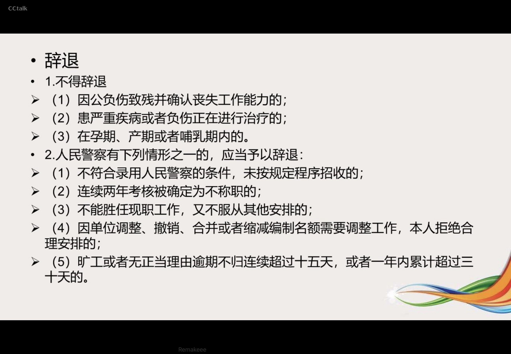

---

mindmap-plugin: basic

---

# 公安队伍正规化建设
## 公安队伍正规化建设的内容
- 四统一
	- 统一考录制度
		- 指新招录公安民警，一律实行省级公安机关和人事部门统一考试，公安部派人督考，切实严把“入口关”，从源头上保证公安队位的基本素质。同时，研究制定协勤、辅助人员管理办法，明确规定其取责权限和工作范困，严禁参与执制度法办案。
	- 统一训练标准
		- 指严格贯彻落实《公安机关人民警察训练条今》，全面实施公安民警上岗和首任必训、职务和警街晋升必训、基层和一线民警每年实战必训的“三个必训”制度。科学制定分级分类的教育训练内容，研究确定科学合理的公安民警能力素质标准和警官的任职、晋升训练标准，用标准建设队伍。
	- 统一纪律要求
		- 指严格执行 《公安机关人民警察纪律条会》，对公安民警在政治纪律、组织纪律、执法执勤纪律、内务纪律等方面实行严格统一的纪律要求。
	- 统一外观标识
		- 指抓紧制定开组织典施公安机关是派出所等“窗口”单位的统一外现标识，方便民群众报警、求助。
- 五规范
	- 规范机构设置
		- 指有效整合警力资源，调整机拘设置，切实解决分工过细、取责交叉、警力分散和各地机构设置不规范，名称规格不统一的问题。
	- 规范职务序列
		- 指从警察取业的性质、特点和工作任务出发，根据《公安机关组织管理条例》 第十条的规定，公安机关人民警察取务分为警官取务、警员取务、警务技术取务。根据警官、警员的不同特点，分别设置警官取务序列、警员取务序列、警务技术职务序列，以体现公安机关不同于一般公务员的特点，充分调动公安民警工作的积极性。
	- 规范编制管理
		- 是指加强公安机关编制管理，规苑公安编制审批使用程序。公安机关人民警察使用的国家行政编制实行专项管理。公安部根据工作需要，向国务院机构编制管理机关提出公安机关编制的规划和调整编制的意见，由国务院机构编制管理机关审核，按照规定的权限和程序审批。省、自治区、直辖市人民政府根格工作需要，可以向国务院机构编制管理机关提出调整公安机关编制的申请。国务院机构编制管理机关（中央编办）对省、自治区、直辖市人民政府调整公安机关编制的申请，征求公安部意见后进行审核，按照规定的权限和程序审批（所需经费统一列地方财政预算）。
	- 规范执法执勤
		- 指进一步建立健全各警种的执法执勤工作规苑，明确民警在执法活动中应该怎么做，不应该怎么做从执法办案、值班备勤等各个环节入手，规范民警的执法执勤活动，做到严格依法办事，提高执法水平。
	- 规范行为举止
		- 指完善公安民警行为的各类规定，从公安民警的着装、仪容、举止、行为、礼节等最基本的行为准则抓起，加强养成教育，使公安民警举止端正、行为规范，形成公安队伍良好的职业风范
- 三个必训
	- 公安民警上岗和首任必训
	- 职务和警衔晋升必训
	- 基层和一线民警每年实战必训
- 新时代公安队伍建设的目标
	- 革命化
	- 正规化
	- 专业化
	- 职业化
- 新时代公安队伍建设的内容
	- 政治建警。增强“四个意识”，坚定“四个自信”，做到“两个维护”
	- 改革强警。推行扁平化管理，把"机关做精、警种做优、基层做强、基础做实”。要树立大抓基层、大抓基础的导向，推动重心下移、警力下沉、保障下倾。
	- 科技兴警。要把大数据作为推动公安工作创新发展的大引擎、培养战斗力生成新的增长点。
	- 从严治警。“有铁一般的理想信念、铁一般的责任担当、铁一般的过硬本领、铁一般的纪律作风”的公安铁军

## 公安机关人民警察的素质和职业道德
1. 对公安机关人民警察的总体要求是：
	1. 政治坚定、业务精通、作风优良、执法公正
	2. 公安队伍战斗力的强弱，取决于人民警察素质的高低
2. 人民警察应具备的素质包括
	1. 政治素质
		1. 政治觉悟
		3. 理想信念
		4. 道德品质
		5. 革命人生观
		- 政治素质，是指人民警察应具有的政治觉悟、理想信念、道德品质和革命人生观的综合体现。对党、对人民的绝对忠诚，是人民警察首要的政治品质。
	2. 业务素质
		1. 业务素质是人民警察依法履行职务，完成各项任务的实际本领，是公安专业知识和专业技能的综合体现。人民警察必须牢固掌握本职工作所涉及的专业基本理论和操作技能，同时，还要具备以下基本能力：
			1. (1）岗位专业能力：
			2. （2）分析综合能力。人民警察必须学会运用马克思主义的立场、观点和方法，把握事物发展的规律性，善于分析事物本质及其联系，因势利导，解决问题;
			3. (3)应变決断能力;
			4. （4)群众工作能力；
			5. （5）写作表达能力。
	3. 法律素质
		1. 法律素质是人民警察依法履行职责、行使职权所应具各的法律意识、法律知识和执法技能的综合体现。包括人民警察依法履行职责、行使职权所应具有的法律意识、法律知识和执法技能的综合体现。
	4. 文化素质
		1. 文化素质不仅指人民警察必须具有相应的文化程度(学历），而且要求人民警察具有良好的文化修养。
	5. 心理素质
		1. 人民警察应具有勇敢、坚定、大胆、果断、顽强、乐于奉献等心理素质特点。
	6. 身体素质
		1. 身体素质，即人民警察的体质，包括体力、运动速度、耐力、灵活性、敏捷性等，是人民警祭各种才能得以正常发挥乃至超常发挥的物质基础。
3. 人民警察意识的主要内容
	1. 大局意识
	2. 政治意识
	3. 忧患意识
	4. 群众意识
	5. 法治意识
4. 政法干警核心价值观
	1. 忠诚、为民】公正、廉洁

## 公安机关人民警察的义务和纪律
- 人民警察义务的主要内容
	1. 秉公执法、办事公道
	2. 模范遵守社会公德
	3. 礼貌待人、文明执勤
	4. 尊重人民群众的风俗习惯
- 人民警察纪律的主要内容
	1. 政治纪律
		1. 政治纪律是有关人民警察政治觉悟、政治行为和政治言论方面的规范。人民警察一定要把国家利益、人民利益放在首位。基于人民警察的性质，对人民警察有关政治方面的纪律主要有：丕得散布有损于国家声登，形象和威信的口头或书面言论：不得参加国家明令取缩、禁止以及禾依法得到批准的社会园体或其他组织：不得参加以反对国家为目的的集会，游行。示威等活动不得参加罢工。
	2. 组织纪律
		1. 组织纪律是对人民警察行动上的要求.一切行动听指挥，是警突职业的一个特点。服从领导才能达到步调一致，行动统一；执行命令，上级的决定才能得到贯彻。因此，服从领导，执行命令是每个人民警容必须具备的素质，是调整公交队伍内部下级与上级，个人与集体。局部与整体之间关系的准则，是完成各项任务的重要保证。其基本内容是：坚持民主集中制原则：下级服从上级，个人服从组织，少数服从多数；不参与派性活动，听从组织调度，自觉接受监督，无条件地完成领号交办的工作。
	3. 执法执勤纪律
		1. 人民警察的工作纪律包活积极履行公务、秉公执法等方面。
			1. ◎积极履行公务，一是严格履行《人民警察法》规定的各项职责，尽职尽责，恪尽职守;二是正确行使 《人民警察法》规定的各项权力，绝不以权谋私；三是执法不阿，敢于同一切不正之风作斗争
			2. 秉公执法，一是严格公正执法；二是廉洁执法
	4. 内务纪律
		1. 涉及人民警察的内部管理与维护人民群众合法权益等方面。一是要求在人事管理各个环节公开公正公平，保证唯才是举，任人唯贤：二是对待人民群众文明礼說，热情耐心，不推诿糖塞，不敷衍了事。不吃拿卡要，不谋取私利。

## 公安机关人民警察的人事管理
### 人民警察的录用
1. 人民警察录用的条件
	1. 《人民警察》明确规定了担任人民警察应当具备的条件
		1. 年满十八岁的公民
		2. 拥护中华人民共和国宪法；
		3. 有良好的政治、业务素质和良好的品行
		4. 身体健康
		5. 具有高中毕业以上文化程度
		6. 自愿从事人民警察工作
	2. 《公安机关人民警察录用办法》不得担任（已废止）
		1. 直系亲属和对本人有重大影响的旁系血亲中有被判死刑或者正在服刑的
		2. 直系亲属和对本人有重大影响的旁系血亲在境内外从事颠覆我国政权活动
	3. 《人民警察法》规定不得担任
		1. 曾因犯罪受过刑事处罚的
		2. 曾被开除公职的
	4. 《公安机关录用人民警察政治考察工作办法》
		1. 第八条
			1. （一）泄露国家秘密、工作秘密，或者有危害国家安全、荣誉和利益行为的；
			2. （二）组织、参加、支持暴力恐怖、民族分裂、宗教极端、邪教、黑社会性质等非法组织，或者参与相关活动的;
			3. （三）组织、参加反对中国共产党的理论和路线方针政策的网络论坛、群组、直播等活动的；
			4. (四）编造、制作、 发表、出版、传播反对中国共产觉、反对中国特色社会主义制度或者违反国家法律法规的有害信息，或者参加国家禁止的政治性组织等的；
			5. (五）通过网络组党结社，参与或者动员不法串联、联署、集会等网上非法活动的；
			6. (六）曾受到刑事处罚或者依据刑法被免子刑事处罚，或者曾被芳动教养、收容教养或者收容教育的；
			7. (七）曾因结伙斗殴、盗窃、诈骗、哄抢、抢奇、敲诈勒索等行为，受到行政拘留处罚的
			8. (八）受过记大过以上处分或者撤销觉内职务以上处分的；被机关按规定3 分消录用的；被机关或者国有企业辞退的;事业单位工作人员被降低岗位等级或者撤职以上处分的；担任领导职务的公务员引咎辞职或者被责令辞职不满三年的；
			9. (九）曾被吊销律师、公证员执业证书的；
			10. (十）曾被开除团籍或者在接受高等教育期间受到开除学籍处分的；
			11. 组织、参加、支持非法集会、游行、示威等活动的；
			12. 压制批评，打声报复或者弄虛作假，误导、欺骗领导或者公众的；
			13. （十三）玩忽职守，贻误工作或者滥用职权，侵害公民、法人以及其他组织的合法权益的;
			14. （十四）贪污、行贿、受贿，利用职务之便为自己或者他人谋取私利或者违反财经纪律，浪费国家或者集体资财的；
			15. （十五）组织、参加、支持色情、吸毒、赌博、迷信等活动的；
			16. (十六）在国家法定考试中被认定有舞弊等严重违纪违规行为或者在法律规定的国家考试以外的其他考试中被认定为组织作弊的；
			17. (十七）已取得或者正在申请国（境）外永久居留权、长期居留许可的；配偶已取得或者正在申请外国国籍或者国 （境）外永久居留权、长期居留许可的；没有配偶，子女全部取得或者正在申请外国国籍或者国（境）外永久居留权、长期居留许可的；上述人员属于香港、澳门居民已领取中华人民共和国居民身份证的除外;
			18. （十八） 个人档案中记载出生日期、参加工作时间、入党（团）时间、学历学位、经历、身份等信息的重要材料缺失、严重失实，且在规定的考察期限内，考察对象无法补齐或者涉嫌涂改造假无法有效认定的；
			19. (十九）严重违反职业道德、社会公德、家庭美德；品德不良，社会责任感和为人民服务意识较差的；
			20. （二十）被依法列为失信联合惩戒对象的；
			21. （二十一）其他不符合担任公安机关人民警察政治素质和道德品行条件的。
		2. 第九条 考察对象的家庭成员具有下列情形之一的，其本人不得确定为拟录用人选：
			1. （一）因故意杀人、故意伤害致人重伤或者死亡、强奸、抢劫、贩卖毒品、放火、爆炸、投放危险物质罪等社会影响恶劣的严重犯罪，或者贪污贿赂数额巨大、具有严重情节，受到刑事处罚的；
			2. (二）有危害国家安全、荣誉和利益行为的；
			3. （三）组织、参加、支持暴力恐怖、民族分裂、宗教极端、邪教、黑社会性质的组织，或者参与相关活动的;
			4. (四）其他可能影响考察对象录用后依法公正履职的情形。
2. 录用人民警察的程序和原则
发布考试公告 进行资格审查 考试 考核 审批
- 对新录用的人民警察实行试用期制度，试用期为1年
- 录用人民警察的原则
	- 公开 平等 竞争 择优
3. 人民警察考核的内容和等次
	1. 考核内容
		1. 德、能、勤、绩、廉，重点考察工作实绩
	2. 考核结果
		1. 优秀、称职、基本称职和不称职
		2. 公安机关人民警察在年度考核中，连续两年被确定为不称职的，应当予以辞退
4. 人民警察教育训练的种类
	1. 初任教育训练
	2. 晋升教育训练（警衔晋升和职务晋升）
	3. 业务教育

### 人民警察奖励的类别、对象和登记
- 奖励工作原则
	- 一）实事求是，按绩及时施奖；
	- （二）发扬民主，贯彻群众路线；
	- 三）公开、公平、公正；
	- （四）以基层一线为重点，领导机关、领导干部从严，、
	- （五）精神奖励与物质奖励相结合，以精神奖励为主
- 奖励分为集体奖励和个人奖励
- 奖励等级：嘉奖，记三等功、二等功、一等功，授予荣誉称号
- 个人荣誉称号是指公安系统二级英雄模范、一级英雄模范.
- 《公安机关组织管理条例》第三十二条
	- 拟以国务院名义授予荣誉称号的，由人事部审核后报国务院审批；拟授予全国公安系统一级英雄模范称号的，由人事部会同公安部审批；拟授予全国公安系统二级英雄模范称号的，由公安部依据国家有关规定审批。

### 人民警察惩处方式
- 《公安机关组织管理条例》 第三十三条
	- 公安机关人民警察违法违纪的，应当根据国家规定给予处分；构成犯罪的，依法追究刑事责任。处分分为：警告、记过、记大过、降级，撒职 开除对对受处分的公安机关人民警察，根据国家规定降低警街或者取消警街。对公安机关人民警察的处分由任免机关或者监察机关決定。
- 行政处分的种类有：警告、记过、记大过、降级、撤职、开除。行政处分是国家行政机关根据行政法规的有关规定，给予有违纪行为的公安民警的惩罚。人民警察受处分期间，不能享受正常的晋升职务、级别；受警告以上行政处分的，不得晋升工资档次。
- 按 《人民警察法》的规定，对受行政处分的人民警察，按照国家有关规定，可以降低警街、取消警街。对违反纪律的人民警察，必要时可以对其采取停止执行职务、禁闭的措施。
- 对违反纪律构成犯罪的人民警察，按照《刑法》规定，依法给予刑事处罚。
#### 处分不服救济手段
- 公务员对涉及本人的下列人事处理不服的，可以白知道该人事处理之日起三十日内向原处理机关申请复核;对复校结果不服的，可以自接到复核决定之日起十五日内，按照规定向同级公务员主管部门或者作出该人事处理的机关的上一级机关提出申诉;也可以不经复核，自知道该人事处理之日起三十日内直接提出申诉：
	- （一）处分;
	- （二）辞退或者取消录用；
	- （三）降职;
	- （四）定期考核定为不称职;（
	- 五）免职；
	- (六）申请辞职、提前退休末予批准；
	- （七）不按照规定确定或者扣减工资、福利、保险待遇;（
	- 八） 法律、法规规定可以申诉的其他情形。
- 对省级以下机关作出的申诉处理决定不服的，可以向作出处理决定的上一级机关提出**再申诉**。受理公务员申诉的机关应当组成公务品申诉公正委员会，负责受理和审理公务员的申诉案件。公务员对监察机关作出的涉及本人的处理决定不服向监察机关申请、复审、复核的，按照有关规定办理，
- 原处理机关应当自接到复核申请书后的三十日内作出复核决定，并以书面形式告知申请人。受理公务员申诉的机关应当自受理之日起六十日内作出处理决定;案情复杂的，可以适当延长，但是延长时间不得超过三十日。复核、申诉期间不停止人事处理的执行。公务员不因申请复核、提出申诉而被加重处理。

#### 《公安机关人民警察纪律条令》
- 公安机关人民警察违法违纪，应当承担纪律责任的，由任免机关或者监察机关按照管理权限依法给予处分。
- 人民警察处分种类：
	1. 行政处分（政务处分）：警告、记过、记大过、降级、撒职、开除
	2. 警纪处分：降级警街、取消警街、停止执行职务、禁闭
	3. 刑事处分（刑事责任）

#### 违法违纪行为处分（重点）
- 有下列行为之一的，给子开除处分：
	- （一）逃往境外或者非法出境、违反规定滞留境外不归的；
	- （二）参与、包庇或者纵容危害国家安全违法犯罪活动的；
	- （三）参与、包庇或者纵容黑社会性质组织犯罪活动的；
	- （四）向犯罪嫌疑人通风报信的；
	- （五）私放他人出入境的。
	- 以实施行政事业性收费、罚没的名义收取钱物，不出具任何票据的，给子开除处分。
	- 吸食、注射毒品或者参与、组织、支持、容留卖淫、嫖娼、色情淫乱活动的，给子开除处分。
- 第一种
	- 有下列行为之一的，给予**记过**或者**记大过**处分；情节较重的，给予**降级**或者**撤职**处分；情节严重的，给予**开除**处分
		1. 故意违反规定立案、撤销立案、提请逮捕、移送起诉的
		2. 违反规定采取、变更、撤销刑事拘留、取保候审、监视居住等刑事强制措施或者行政拘留的
		3. 非法剥夺，限制他人身自由的
		4. 非法搜查他人身体、物品、住所或者场所的
		5. 违反规定延长羁押期限或者变相拘禁他人的
		6. 违反规定采取通缉等措施或者擅自使用侦查手段侵犯公民合法权益的
		7. 违反规定为在押人员办理保外就医、所外执行的
		8. 擅自安排在押人员与其亲友会见，私自为在押人员或者其亲友传递物品、信件，造成不良后果的
		9. 指派在押人员看管在押人员
		10. 私带在押人员离开羁押场所的
		- 从中谋利的，从重处分
		11. 对依法应当办理的受理案件、立案、撤销案件、提请逮捕、移送起诉等事项，无正当理由不予办理的
		12. 对管辖范围内发生的应当上报的重大治安案件、刑事案件、特大道路交通事故和群体性或者突发性事件等隐瞒不报或者谎报的
		13. 在勘验、检查、鉴定等取证工作中严重失职，造成无辜人员被处理或者违法犯罪人员逃避法律追究的
		14. 因工作失职造成被羁押、监管人员脱逃、致残、致死或者其他不良后果的
		15. 在值班、备勤、执勤时擅离岗位，造成不良后果的
		16. 不履行办案协作职责造成不良后果的
		17. 在执行任务时临危退缩、临阵脱逃的
		18. 利用职权干扰执法办案或者强令违法办案的
		19. 利用职权干预经济纠纷或者为他人追债讨债的
		20. 隐瞒或者伪造案情的
		21. 伪造、变造、隐匿、销毁检举控告材料或者证据材料的
		22. 出具虚假审查或者证明材料、结论的
- 第二种
	- 给予警告、记过或者记大过处分；情节较重的，给予降级或者撤职处分；情节严重的，给予开除处分
		1. 拒绝执行上级依法作出的决定、命令，或者在执行任务时不服从指挥的
		2. 违反规定进行人民警察录用、考核、任免、奖惩、调任、转任的
- 第三种
	- 造成不良影响的，给予警告处分；情节较重的，给予记过处分；情节严重的，给予记大过处分
		1. 在工作中对群众态度蛮横、行为粗暴、故意刁难或者吃拿卡要的
		2. 不按规定着装，严重损害人民警察形象的
		3. 非因公务着警服进入营业性娱乐场所的
- 第四种
	- 给予警告或者记过处分；情节较重的，给予记大过或者降级处分；情节严重的，给予撤职或者开除处分
		1. 违反警车管理使用规定或者违反规定使用警灯、警报器的
		2. 违反规定转借、赠送、出租、抵押、转卖警用车辆、警车号牌、警械、警服、警用标志和证件的
		3. 违反规定使用警械的
		4. 参与、包庇或者纵容违法犯罪活动的

