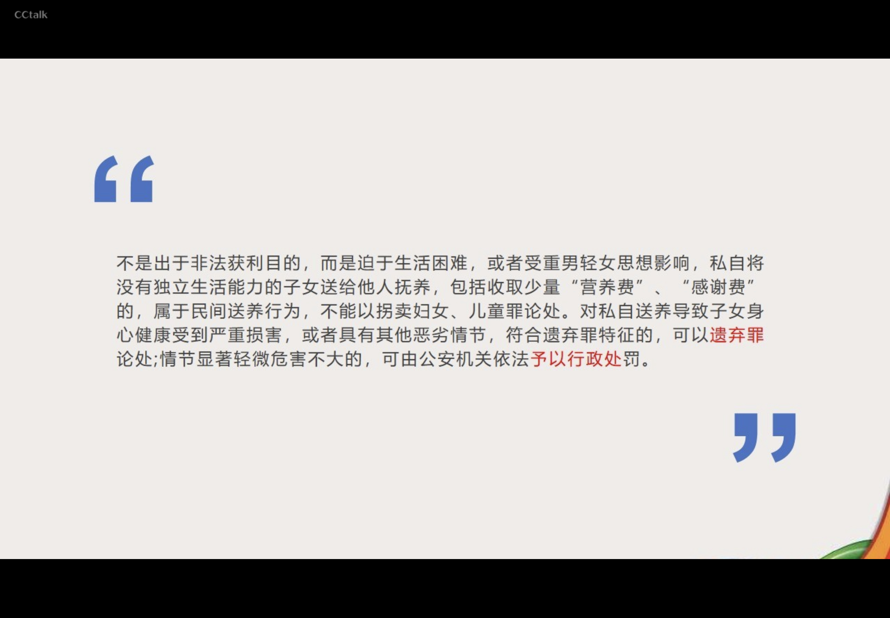

---

mindmap-plugin: basic

---

# 

不是出于非法获利目的，而是迫于生活困难，或者受重男轻女思想影响，私自将没有独立生活能力的子女送给他人抚养，包括收取少量“营养费〞、〞感谢费〞的，属于民间送养行为，不能以拐卖妇女、儿童罪论处。对私自送养导致子女身心健康受到严重损害，或者具有其他恶劣情节，符合遗弃罪特征的，可以遗弃罪论处;情节显著轻微危害不大的，可由公安机关依法子以行政处罚。

以介绍婚姻为名，采取非法扣押身份证件、限制人身自由等方式，或者利用妇女人地生疏、语言不通一孤立无援等境況，违背妇女意志，将其出卖给他人的，应当以拐卖妇女罪追究刑事责任。
以介绍婚姻为名，与被价绍妁交串通骗取他人钱财，数额较大的，应当以诈骗罪追究刑事责任。

- 共同犯罪
	- 明知他人拐卖妇女、儿童，仍然向其提供被拐卖妇女、儿童的健康证明、出生证明或者其他帮助的，以拐卖妇女、儿童罪的共犯论处。
	- 明知他人收买被拐卖的妇女、儿童，仍然向其提供被收买妇女、儿童的户籍证明、出生证明或者其他帮助的，以收买被拐卖的妇女、儿童罪的共犯论处，但是，收买人未被追究刑事责任的除外。
	- 认定是否 “明知〞，应当根据证人证言、犯罪媒疑人、被告人及其同案人供述和辩解，结合提供帮助的人次，以及是否明显违反相关规章制度、工作流程等，予以综合判断。
	- 明知他人系拐卖儿童的 “人贩子”，仍然利用从事诊疗、福利救助等工作的便利或者了解
	- 被拐卖方情况的条件，居间介绍的，以拐卖儿童罪的共犯论处。

- 一罪与数罪（重点）
	- 拐卖妇女、儿童，又奸淫被拐卖的妇女、儿童，或者诱骗、强迫被拐卖的妇女、儿童卖淫的，以拐卖妇女、儿童罪处罚。
	- 拐卖妇女、儿童，又对被拐卖的妇女、儿童实施故意杀害、伤害、猥亵、侮辱等行为，构成其他犯罪的，依照数罪并罚的规定处罚。
	- 拐卖妇女、儿童或者收买被拐卖的妇女、儿童，又组织、教唆被拐卖、收买的妇女、儿童进行犯罪的，以拐卖妇女、儿童罪或者收买被拐卖的妇女、儿童罪与其所组织、教唆的罪数罪并罚。
	- 拐卖妇女、儿童或者收买被拐卖的妇女、儿童，又组织、教唆被拐卖、收买的未成年妇女、儿童进行盗窃、诈骗、抢夺、敲诈勒索等违反治安管理活动的，以拐卖妇女、儿童
	- 罪或者收买被拐卖的妇女、儿童罪与组织末成年人进行违反治安管理活动罪数罪并罚。

- tip
	- 收买被拐卖妇女、儿童的，定收买被拐卖的妇女、儿童罪。
	- 收买被拐卖妇女、儿童的，强行与其发生性关系的，依照数罪并罚的规定处罚
	- 收买被拐卖妇女、儿童的又出卖的，依照拐卖妇女、儿童罪定罪处罚。
	- 收买被拐卖的妇女、儿童，对被买儿童没有虐待行为，不阻碍对其进行解救的，可以从轻处罚;按照被买妇女的意愿，不阻碍其返回原居住地的，可以从轻或者减轻处罚。（《刑法修正案九》 最新变化）

## 拐骗儿童罪
- 一．拐骗不满十四周岁的未成年人，脱离家庭或者监护人的，处五年以下有期徒刑或拘役。
- 二．区分拐骗儿童罪和拐卖儿童罪的关键就在于行为人实施犯罪的主观目的。拐骗儿童罪的行为人不以出卖儿童（包括婴儿、幼儿）为目的，其目的通常是自己或者送他人收养，也有少数收养者是为了自己使唤、奴役拐骗来的儿童。拐卖儿童罪则必须以出卖为目的，无此目的就不构成该罪。

## 强奸罪
- 定义
	- ◎以暴力、胁迫或者其他手段强奸妇女的；
	- ②奸淫不满十四周岁的幼女的。
- 对象 
	- 已满14周岁的好女和不满14周岁的幼女。【男子不是强好罪的对象】
- 方式
	1. 暴力手段;
	2. 胁迫手段;主要通过引起被害妇女的恐惧心理所实施的相应行为。这种威胁的对象既可以是该妇女，也可以是与被害妇女有利害关系的人。以加害人自己相威助的，不属手助迫，不构成强奸罪。
	3. ⑨其他手段。使妇女不知抗拒成不能抗拒的手段，具有与暴力、胁迫相同的理制性质。例如“灌醉"  “麻醉"  "熟睡’“假冒治病、组织和利用会道门、邪教组织、利用迷信奸淫妇女〞等
- 奸淫幼女 
	- 行为人明知是不满十四周岁的幼女而与其发生性关系，不论幼女是否自愿，均应依照刑法第二百三十六条第二款的规定，以强奸罪定罪处罚；行为人确实不知对方是不满十四周岁的幼女，双方自愿发生性关系，未造成严重后果，情节显著轻微的，不认为是犯罪

- 《关于依法惩治性侵害未成年人犯罪的意见》
	- 两小无猜条款
		- 已满十四周岁不满十六周岁的人偶尔与幼女发生性行为，情节轻微、未造成严重后果的，不认为是犯罪
- 加重情形（修改）
	- 强奸妇女、奸淫幼女，有下列情形之一的，处十年以上有期徒刑、无期徒刑或者死刑
		1. 强奸妇女、奸淫幼女清洁恶劣的
		2. 强奸妇女、奸淫幼女多人的
		3. 在公共场所当众强奸妇女、奸淫幼女的（新修改）
		4. 二人以上轮奸的
		5. 奸淫不满十周年的幼女或者造成幼女伤害的（新修改）
		6. 致使被害人重伤、死亡或者造成其他严重后果的
## 负有照护职责人员性侵罪
- 对已满＋四周岁不满十六周岁的未成年女性负有**监护**、**收养**。**看护**、**教育**、**医疗**等特殊职责的人员，与该未成年女性发生性关系的，处三年以下有期徒刑：情节恶劣的，处三年以上十年以下有期徒刑。
- 有前款行为，同时又构成本法第二百三十六条规定之罪的，依照处罚较重的规定定罪处罚。
## 猥亵儿童罪
猥亵儿童的，处五年以下有期徒刑；有下列情形之一的，处五年以上有期徒刑：
- 猥亵儿童多人或者多次的；
- 聚众猥亵儿童的，或者在公共场所当众猥亵儿童，情节恶劣的；
- 造成儿童伤害或者其他严重后果的；
- 猥亵手段恶劣或者有其他恶劣情节的。
## 寻衅滋事罪 
•寻衅滋事罪为有下列寻衅滋事行为之一，破坏社会秩序的，处五年以下有期徒刑、拘役或者管制：
	1. 随意殴打他人，情节恶劣的；
	2. 追逐、拦截、辱骂他人，情书恶劣的；
	3. 强拿硬要或者任意损毁、占用公私财物，情节严重的；
	4. 在公共场所起哄闹事，造成公共场所秩序严重混乱的。
- 利用信息网络辱骂、恐吓他人，情节恶劣，破坏社会秩序的，以寻衅滋事罪定罪处罚。编造虛假信息，或者明知是编造的虚假信息，在信息网络上散布，或者组织、指使人员在信息网络上散布，起哄闹事，造成公共秩序严重混乱的，以寻蝆滋事罪  定罪处罚。
### 寻衅滋事认定
- 一．行为人为寻求刺激、发泄情绪、逞强要横等，无事生非，实施刑法第二百九十三条规定的行的，应当认定为 “寻蛘滋事〞。行为人因日常生活中的偶发矛盾纠纷，借故生非，实施刑法第二百九十三条规定的行为的，应当认定为 “寻蝆滋事〞，但矛盾系由被害人故意引发或者被害人对矛盾激化负有主要责任的除外。
- 二．行为人因婚恋、家庭、邻里、债务等纠纷，实施殴打、辱骂、恐吓他人或者损毁、占用他人财物等行为的，一般不认定为 “寻蛘滋事〞，但经有关部门批评制止或者处理处罚后，继续实施前列行为，破坏社会秩序的除外。
### 寻衅滋事罪与故意伤害罪的区别
1. 侵犯对象是否特定
2. 侵害行为是否事出有因
3. 发生地点是否具有公众性
- 一般满足两个以上
- 寻衅滋事导致他人重伤或死亡的，应以故意伤害罪或者故意杀人罪论处

- 随意殴打他人，破坏社会秩序，具有下列情形之一的，应当认定为刑法第二百九十三条第一款第一项规定的“**情节恶劣**〞：
	1. 致一人以上轻伤或者二人以上轻微伤的；
	2. 引(起他人精神失常、自杀等严重后果的；
	3. 多次随意殴打他人的；
	4. 持凶器随意殴打他人的;
	5. 随意殴打精神病人、残疾人、流浪乞讨人员、老年人、孕妇、未成年人，造成恶劣社会影响的；
	6. 在公共场所随意殴打他人，造成公共场所秩序严重混乱的；
	7. 其他情节恶劣的情形。

## 袭警罪
- 暴力袭击正在依法执行职务的人民警察的，处三年以下有期徒刑、拘役或者管制；使用枪支、管制工具、或者以驾驶机动车撞击等手段，严重危及其人身安全的，处三年以上七年以下有期徒刑
- 《浙江省高级人民法院、浙江省人民检察院、浙江省公安厅办理袭警犯罪案件的指导意见》
	- 第八条 有下列行为之一，符合刑法第二百七十七条第一款规定的，以**妨害公务罪**追究刑事责任。
		- (一)对正在依法执行职务的民警虽末实施暴力袭击，但以实施暴力相威胁；
		- (二）以暴力、威胁方法阻碍协助人民 警察依法执行职务的警务辅助人员；
		- （三）实施打砸、毁坏民警正在使用的警用车辆、警械、执法记录仪、警务通对对讲机等警用装备，造成较大数额财产损失的；
		- （四)采用其他方法阻碍人民警察执行职务的。
- 阻碍执行积务行为是指行为人采取吵闹、漫骂、无理纠缠、侮辱、拉扯、撕毁封条、拒不接受检查等方法，故意阻碍国家机关工作人员执行职务的行为。该阻碍行为没有使用暴力或暴力威胁手段，没有造成严重后果，尚不够刑事处罚，属于违法行为。〝依法执行职务〞 是指国家机关工作人员依照法律、法规规定所进行的职务行为。
- 妨害公务罪是指以暴力、威胁方法阻碍国家机关工作人员、人大代表依法执行职务，或者在自然灾害中和突发事件中，使用暴力、威胁方法阻碍红十字会工作人员依法履行职责，或故意阻碍国家安全机关、公安机关依法执行国家安全工作任务，里末使用暴力，但造成严重后果的行为。

## 冒名顶替罪
- 盗用、冒用他人身份，顶替他人取得的高等学历教育入学资格、公务品录用资格、就业安置待遇的，处三年以下有期徒刑、拘役或者管制，并处罚金。
- 组织、指使他人实施前款行为的，依照前款的规定从重处罚。
- 国家工作人员有前两款行为，又构成其他犯罪的，依照数罪并罚的规定处罚。

## 份造、变造、买卖国家机关公文、证件、印章罪；盗窃、抢夺、毁灭国家机关公文、证件、印章罪
- 伪造、变造、买卖或者盗窃、抢夺、毁灭国家机关的公文、证件、印章的，处三年以下有期徒刑、拘役、管制或者剥夺政治权利，并处罚金；  情节严重的，处三年以上十年以下有期徒刑，并处罚金。
## 伪造公司、企业、事业单位、人民团体印章罪
- 伪造公司、企业、事业单位、人民团体的印章的，处三年以下有期徒刑、拘役、管制或者剥夺政治权利，并处罚金。
## 伪造、变造、买卖身份证件罪
伪造、变造、买卖居民身份证、护照、社会保障卡、驾驶证等依法可以用于证明身份的证件的，处三年以下有期徒刑、拘役、管制或者剥夺政治权利，并处罚金;情节严重的，处三年以上七年以下有期徒刑，并处罚金。
## 使用虚假身份证件、盗用身份证件罪
- 在依照国家规定应当提供身份证明的活动中，使用伪造、变造的或者盗用他人的居民身份证、护照、社会保障卡、驾驶证等依法可以用于证明身份的证件，情节严重的，处拘役或者管制，并处或者单处罚金。  有前款行为，同时构成其他犯罪的，依照处罚较重的规定定罪处罚。
## 高空抛物罪
- 从建筑物或者其他高空抛掷物品，情节严重的，处一年以下有期徒刑、拘役或者管制，并处或者单处罚金
- 有前款行为，同时构成其他犯罪的，依照处罚较重的规定定罪处罚
## 催收非法债务罪
- - 有下列情形之一，催收高利放货等产生的非法债务，情节严重的，处三年以下有期徒刑、拘役或者管制，并处或者单处罚金：
    - 使用暴力、胁迫方法的；
    - 限制他人人身自由或者侵入他人住宅的；
    - 恐吓、跟踪、骚扰他人的。
## 妨害药品管理罪
•违反药品管理法规，有下列情形之一，足以严重危害人体健康的，处三年以下有期徒刑或者拘役，并处或者单处罚金；对人体健康造成严重危害或者有其他严重情节的，处三年以上七年以下有期徒刑，并处罚金：
    1. 生产、销售国务院药品监督管理部门禁止使用的药品的；
    2. 未取得药品相关批准证明文件生产、进口药品或者明知是上述药品而销售的；
    3. 药品申请注册中提供虛假的证明、数据、资料、样品或者采取其他欺骗手段的；
    4. 编造生产、检验记录的。
- 有前款行为，同时又构成本法第一百四十一条、第一百四十二条规定之罪或者其他犯罪的，依照处罚较重的规定定罪处罚。
## 生产销售假药罪
- 生产、销售假药的，处三年以下有期徒刑或者拘役，并处罚金;对人体健康造成严重危害或者有其他严重情节的，处三年以上十年以下有期徒刑，并处罚金;致人死亡或者有其他特别严重情节的，处十年以上有期徒刑、无期徒刑或者死刑，并处罚金或者没收财产。
- 药品使用单位的人员明知是假药而提供给他人使用的，依照前款的规定处罚。
## 生产、销售劣药罪
- 生产、销售劣药，对人体健康造成严重危害的，处三年以上十年以下有期徒刑，并处罚金;后果特别严重的，处十年以上有期徒刑或者无期徒刑，并处罚金或者没收财产。
- 药品使用单位的人员明知是劣药而提供给他人使用的，依照前款的规定处罚。
## 赌博类犯罪
### 赌博罪
- 以营利为目的，聚众赌博或者以赌博为业的，处三年以下有期徒刑、拘役或者管制，并处罚金。
### 开设赌场罪
- 开设赌场的，处五年以下有期徒刑、拘役或者管制，并处罚金;情节严重的，处五年以上十年以下有期徒刑，并处罚金。
### 组织参与国(境)外赌博罪
- 组织中华人民共和国公民参与国(境)外赌博，数额巨大或者有其他严重情节的，依照前款的规定处罚。（新增）
## 妨害传染病防治罪

违反传染病防治法的规定，有下列情形之一，引起甲类传染病以及依法确定 采取甲类传染病预防、控制措施的传染病传播或者有传播严重危险的，处三年以下有期徒刑或者拘役；后果特别严重的，处三年以上七年以下有期徒刑：
    （一）供水单位供应的饮用水不符合国家规定的卫生标准的；
    二）拒绝按照疾病预防控制机构提出的卫生要求，对传染病病原体污染的污水、污物、场所和物品进行消毒处理的；
    (三）准许或者纵容传染病病人、病原携带者和疑似传染病病人从事国务院卫生行政部门规定禁止从事的易使该传染病扩散的工作的；
    (四）出售、运输疫区中被传染病病原体污染或者可能被传染病病原体污染的物品，未进行消毒处理的；
    (五）拒绝执行县级以上人民政府、疾病预防控制机构依照传 染病防治法提出的预防、控制措施的。
## 洗钱罪
- 为掩饰、隐瞒毒品犯罪、黑社会性质的组织犯罪、恐怖活动犯罪、走私犯罪、贪污贿赂犯罪、破坏金融管理秩序犯罪、金融诈骗犯罪的所得及其产生的收益的来源和性质，有下列行为之一的，没收实施以上犯罪的所得及其产生的收益，处五年以下有期徒刑或者拘役，并处或者单处罚金；情节严重的，处五年以上十年以下有期徒刑，并处罚金：
    1. 提供资金帐户的；
    2. 将财产转换为现金、金融票据、有价证券的；
    3. 通过转帐或者其他支付结算方式转移资金的；
    4. 跨境转移资产的；
    5. 以其他方法掩饰、隐瞒犯罪所得及其收益的来源和性质的。
- 单位犯前款罪的，对单位判处罚金，并对其直接负责的主管人员和其他直接责任人员，依照前款的规定处罚。
## 侵害英雄烈士名誉、荣誉罪
- 侮辱、诽谤或者以其他方式侵害英雄烈士的名誉、荣誉，损害社会公共利益，情节严重的，处三年以下有期徒刑、拘役、管制或者剥夺政治权利。
## 侮辱国旗、国徽罪；侮辱国歌罪（《刑法修正案十》新增）
- 在公共场合，故意以焚烧、毁损、涂划、玷污、践踏等方式侮辱中华人民共和国国旗 国徽的，处三年以下有期徒刑、拘役、管制或者剥夺政治权利。
- 在公共场合，故意篡改中华人民共和国国歌歌词、曲谱，以歪曲、贬损方式奏唱国歌，或者以其他方式侮辱国歌，情节严重的，依照前款的规定处罚。
## 组织出卖人体器官罪
- 组织出卖人体器官罪，是指在征得被害人同意或者承诺，组织出卖人体器官以获得非法利益的行为
- 注意
    - 未经本人同意摘取其器官，或者摘取未满十八周岁的人的器官，或者强迫、欺骗他人捐献器官的，定故意伤害罪、故意杀人罪
    - 违背本人生前意愿摘取其尸体器官，或者本人生前未表示同意，违反国家规定，违背其近亲属意愿摘取其尸体器官的，定盗窃、侮辱尸体罪
## 拒不支付劳动报酬罪
- 恶意欠薪入刑
- 拒不支付劳动报酬罪是指以转移财产、逃匿等方法逃避支付劳动者的劳动报酬或者有能力支付而不支付劳动者的劳动报酬，数额较大，经政府有关部门责令支付仍不支付的行为。
## 亲告罪
### 侮辱罪、诽谤罪（但是严重危害社会秩序和国家利益的除外）
### 暴力干涉婚姻自由罪 （致使被害人死亡的除外）
### 虐待罪（致使被害人重伤、死亡的除外）
### 侵占罪（绝对亲告罪）
## 国家工作人员相关的几种常见犯罪
- 国家工作人员：国家机关、国有公司、企事业单位、人民团体的工作人员
### 贪污罪
- 指国家工作人员利用职务的便利、侵吞、窃取、骗取或者其他手段非法占有公共财物的行为
- 构成要件
    1. 本罪侵犯的客体：同时侵犯了国家工作人员职务行为的廉洁性和公共财产所有权
    2. 本罪在客观方面：表现为行为人利用职务上的便利，侵吞、窃取、骗取或者以其他手段非法占有公共财物
    3. 本罪的主体：必须是国家工作人员
    4. 本罪在主观方面：故意，并且具有非法占有公共财物的目的
### 挪用公款
- 指国家工作人员利用职务上的便利，
    1. 挪用公款归个人使用，进行非法活动
    2. 挪用公款数额较大，进行营利活动
    3. 挪用公款数额较大，超过三个月未还的行为
- 构成要件
    - (1）本罪侵犯的客体：既侵犯国家工作人员的职务廉洁性，也侵犯公共财产的占有、使用、收益权
    - (2）本罪的客观方面：表现为行为人利用职务上的便利，挪用公款归个人使用，进行非法活动，或者挪用数额较大进行营利活动，或者挪用公款数额较大超过了个月未还的行为。
    - （3）本罪的主体：只能由国家工作人员构成。
    - (4） 本罪的主观方面：故意，即明知是公款而有意违反有关规定予以挪用，其目的是非法取得公款的使用权。
### 受贿罪
- 是指国家工作人员利用职务上的便利，索取他人财务的，或者非法收受他人财物，为他人谋取利益的行为。
1. 构成要件
    1. (1）客体：是复杂客体，分为次要客体和主要客体。
    2. (2）客观方面：表现为行为人具有利用职务 上的便利，向他人索取财物，或者收受他人财物并为他人谋取利益的行为。
    3. (3） 主体：是特殊主体，即国家工作人员。
    4. (4）主观方面：由故意构成，只有行为人是出于故意所实施的受贿犯罪行为才构成受贿罪，过失行为不构成本罪。
### 行贿罪
- 是指为谋取不正当利益，给子国家工作人员以财务的行为。
1. 构成要件
    1. 本罪侵犯的客体：国家工作人员的职务廉洁性。
    2. 本罪在客观方面：表现为实施了给子国家工作人员财务的行为。
    3. 本罪的主体：一般主体，已满16周岁具有刑事责任能力的自然人都可以成为本罪的主体。
    4. 本罪在主观方面：故意，并且具有谋取不正当利益的目的。
### 受贿罪与行贿罪的关系：
- 它们是一种对合犯罪，也就是行购和受贿互为条件，从它们行为角度看，有行贿才有受贿存在，有受贿必有行贿存在。但从构成犯罪的角度上看，二者的对合关系并不是绝对化的，构成行贿罪不一定就构成相应的受贿罪：构成受贿罪也不一定就构成相应的行贿罪，出现这种情况的主要是因为：有关法律规定给付财物方不是行贿，而收受财物方却是受贿。如我国刑法第三百八十九条第三款规定：“因被勒索给予国家工作人员以财物，没有获得不正当利益的，不是行贿”，就是这种情况。
### 利用影响力受贿罪
- 国家工作人员的近亲属或者其他与该国家工作人员关系密切的人，通过该国家工作人员职务上的行为，或者利用该国家工作人员职权或者地位形成的便利条件，通过其他国家工作人员职务上的行为，为请托人谋取不正当利益，索取请托人财物或者收受请托人财物，数额较大或者有其他较重情节的，处三年以下有期徒刑或者拘役，并处罚金;数额巨大或者有其他严重情节的，处三年以上七年以下有期徒刑，并处罚金；数额特别巨大或者有其他特别严重情节的，处七年以上有期徒刑，并处罚金或者没收财产。
- 离职的国家工作人员或者其近亲属以及其他与其关系密切的人，利用该离职的国家工作人员原职权或者地位形成的便利条件实施前款行为的，依照前款的规定定罪处罚。
### 巨额财产来源不明罪
- 概念：是指国家工作人员的财产或者支出明显超出合法收入，差额巨大，本人不能说明其来源是合法的行为
### 私分国有资产罪
- 概念：是指国家机关、国有公司、企事业单位、人民团体，违反国家规定，以单位名义将国有资产集体私分给个人，数额较大的行为。
- 构成要件：
    - 主体：特殊主体，只能由国有单位人员构成
    - 主观方面：直接故意
    - 客体：国家工作人员的职务廉洁性，也侵犯国有资产所有权。对象为国有资产。
    - 客观方面：表现为行为人违反国家规定，以单位名义将国有资产集体私分给个人，数额较大的行为
### 私分罚没财物罪
- 指司法机关、执法行政机关违反国家规定，将应当上缴国家的罚没财务，以单位名义集体私分给个人的行为
### 滥用职权罪
- 国家机关工作人员滥用职权，致使公共财产、国家和人民利益遭受到重大损失的行为
### 玩忽职守罪
- 国家机关工作人员玩忽职守，致使公共财产、国家和人民利益遭受到重大损失的行为
### 滥用职杈罪与玩忽职守罪的区别
- 主观方面的区别
    - 滥用职权罪主要是由故意构成
    - 玩忽职守罪王要由过失构成。
- 行为方式的主要区别
    - 滥用职权罪的行为方式主要表现为作为一干了不该干的
    - 玩忽职守罪主要表现为以不作为一该干的不干
## 涉黑常见罪名
- 黑社会性质的组织应当当时具备以下特征
    1. 形成较稳定的犯罪组织，人数较多，有明确的组织者、领导者，骨干成员基本固定
    2. 有组织地通过违法犯罪活动或者其他手段获取经济利益，具有一定的经济实力，以支持该组织的活动
    3. 以暴力、威胁或者其他手段，有组织地多次进行违法犯罪活动，为非作恶，欺压、残害群众
    4. 通过实施违法犯罪活动，或者利用国家工作人员的包庇或者纵容，称霸一方，在一定区域内或者行业内，形成非法控制或者重大影响，严重破坏经济、社会生活秩序
### 组织、领导、参加黑社会性质组织罪
- 组织、领导黑社会性质的组织的，处七年以上有期徒刑，并处没收财产；
- 积极参加的，处三年以上七年以下有期徒刑，可以并处罚金或者没收财产
- 其他参加的，处三年以下有期徒刑、拘役、管制或者剥夺政治权利，可以并处罚金
### 入境发展黑社会组织罪
- 境外的黑社会组织的人员到中国人民共和国境内发展组织成员，处三年以下十年以上有期徒刑
### 包庇、纵容黑社会性质组织罪
- 国家机关工作人员包庇黑社会性质的组织，或者纵容黑社会性质的组织进行违法犯罪活动的，处五年以下有期徒刑
- 情节严重的，处五年以上有期徒刑
### 处罚
- 组织、领导、参加黑社会性质的组织又有其他犯罪行为的，根据刑法第二百九十四条第三款的规定，依照数罪并罚的规定处罚：对于黑社会性质组织的组织者、领导者，应当按照其所组织、领导的黑社会性质组织所犯的全部罪行处罚；对于黑社会性质组织的参加者，应当按照其所参与的犯罪处罚。
## 恶势力
- 恶势力，是指经常纠集在一起，以暴力、威胁或者其他手段，在一定区域或者行业内多次实施违法犯罪活动，为非作恶，欺压百姓，扰乱经济、社会生活秩序，造成较为恶劣的社会影响，但尚未形成黑社会性质组织的违法犯罪组织。
    - 一 ．恶势力一般为3人以上，纠集者相对固定。
    - 二.犯罪嫌疑人、被告人于2年之内，以暴力、威胁或者其他手段，在一定区域或者行业内多次实施违法犯罪活动，且包括纠集者在内，至少应有2名相同的成员多次参与实施违法犯罪活动。
    - 三．恶势力实施的违法犯罪活动，主要为强迫交易、故意伤害、非法拘禁、敲诈勒素、故意毁坏财物、聚众斗殴、寻蛘滋事，但也包括具有为非作恶、欺压百姓特征，主要以暴力、威胁为手段的其他违法犯罪活动。
    - 四．一般无合法经济来源，经济实力较弱，没有大的经济实体，保护伞和关系网不明确，或层次较低。
### 涉恶常见罪名
#### 强迫交易罪
#### 敲诈勒索罪
#### 寻衅滋事罪
#### 聚众斗殴罪
#### 非法拘禁罪
#### 故意毁坏财物罪
#### 组织卖淫罪、强迫卖淫罪、协助组织卖淫罪
#### 开设赌场罪
## 《头于办理非法放货刑事案件若干问题的意见》
- 违反国家规定，未经监管部门批准，或者超越经营范围，以营利为目的，经常性地向社会不特定对象发放货款，扰乱金融市场秩序，情节严重的，依照刑法第二百二十五条第(四）项的规定，以非法经营罪定罪处罚。
- "经常性地向社会不特定对象发放货款〞，是指2年内向不特定多人（包括单位和个人）以借款或其他名义出借资金10次以上。
- 货款到期后延长还款期限的，发放货款次数按照1次计算。
1. 为从事非法放货活动，实施擅自设立金融机构、套取金融机构资金高利转货、骗取贷款、非法吸收公众存款等行为，构成犯罪的，应当择一重罪处罚。
2. 为强行索要因非法放贷而产生的债务，实施故意杀人、故意伤害、非法拘禁、故意毁坏财物、寻鲜滋事等行为，构成犯罪的，应当数罪并罚。
3. 纠集、指使、雇佣他人采用滋扰、纠缠、哄闹、聚众造势等手段强行索要债务，尚不单独构成犯罪，但实施非法放货行为已构成非法经营罪的，应当按照非法经营罪的规定酌情从重处罚。
