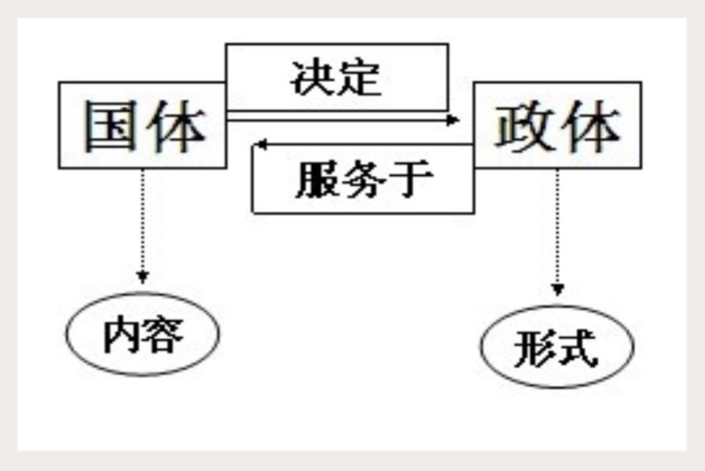
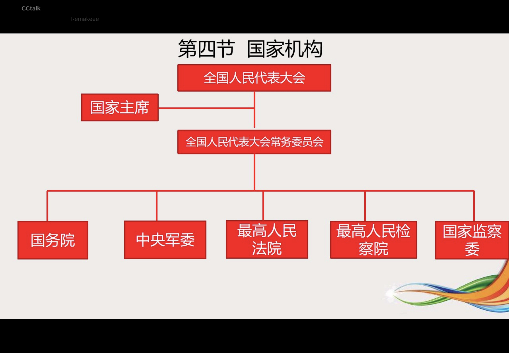
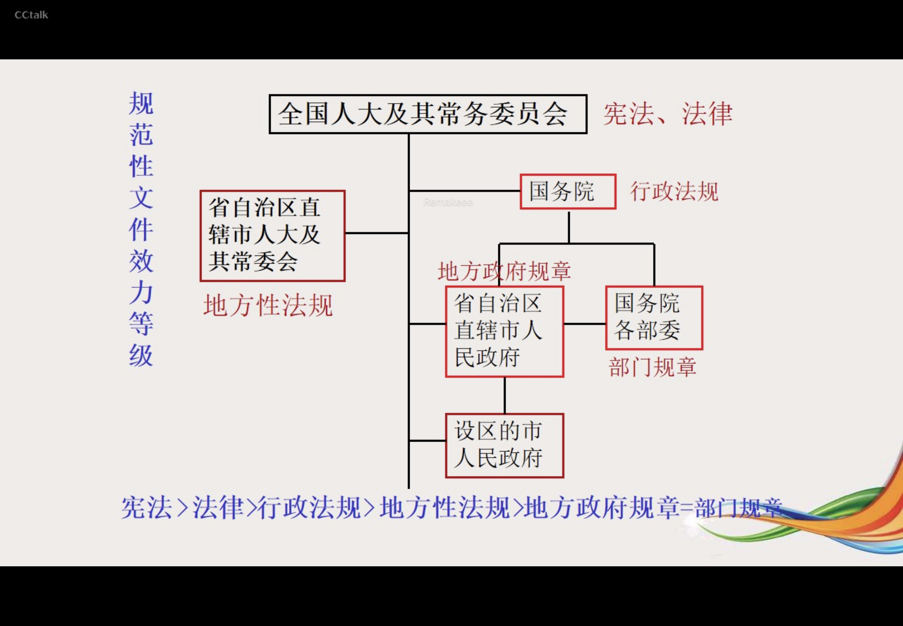

# 宪法基本理论
## 宪法的概念和特征
### 概念
- 宪法是国家的根本大法，**它集中反映各种政治力量的实际对比关系**，规定国家的根本任务和根本制度即社会制度、国家制度的原则和国家政权的组织以及公民的基本权利义务等内容。
- 宪法的核心价值：限制国家权力 + 保障公民权利
### 特征
1. 宪法是根本大法  
    1. 内容上,规定国家的根本任务和根本制度【规定的是国家最根本、最核心的问题】
    2. 法律效力上，法律效力最高。
        1. 宪法是制定普通法律的依据;
        2. 任何普通法律、法规都不得与宪法的原则和精神相违背；
        3. 宪法是一切国家机关、社会团体和全体公民的最高行为准则。
     3. 制定和修改程序上，比普通法律严格。
2. 宪法是公民权利的保障书—最核心价值
3. 宪法是民主事实法律化的基本形式。
- 与宪法相违背时，自动失效
## 宪法的基本原则
### 1.人民主权原则
- 《宪法》第2条规定：“国家的一切权力属于人民，人民行使权力的机关是全国人民代表大会和地方各级人民代表大会。人民依照法律规定，通过各种途径和形式，管理国家事务，管理经济和文化事业，管理社会事务〞
### 2.基本人权原则
- 2004年《宪法修正案》“国家尊重和保障人权〞。
### 3.法制原则
- 宪法在第5条详细规定了法治原则：
    (1）国家实行依法治国，建设社会主义法治国家;
    （2）国家维护社会主义法制的统一和尊严；
    （3）一切法律、行政法规和地方性法规都不得同宪法相抵触；  
    (4） 一切国家机关和武装力量、各政党和各社会团体、各企业事业组织都必须遵守宪法和法律；  
    (5）一切违反宪法和法律的行为，必须予以追究;
    （5)任何组织或者个人都不得有超越宪法和法律的特权。
### 4.分权原则
### 5.民主集中原则
- “中华人民共和国的国家机构实行民主集中制的原则。全国人民代表大会和地方各级人民代表大会都由民主选举产生，对人民负责，受人民监督。国家行政机关、监察机关、审判机关、检察机关都由人民代表大会产生，对它负责，受它监督。中央和地方的国家机构职权的划分，遵循在中央的统一领导下，充分发挥地方的主动性、积极性的原则。〞
## 历次宪法修改
### 1988年
#### 增加
- 国家允许私营经济在法律规定的范围内存在和发展。私营经济是社会主义公有制经济的补充，对私营经济实行引导、监督和管理
#### 修改
- 不得侵占、买卖或者以其他形式非法转让土地。土地使用权可以转让
### 1993年
#### 增加
- “初级阶段理论”入宪（将“我国正处于社会主义初级阶段”“建设有中国特色社会主义的理论”“坚持改革开放”等提法写入宪法序言）
- 中国共产党领导的多党合作和政治协商制度将长期存在和发展
#### 修改
- “计划经济”改为“市场经济”
- “国营经济”改为“国有经济”
- 农村中的家庭联产承包为主的责任制取代“公社”、“合作社”
- 县级人大任期由3年改为5年
### 1999年
#### 增加
- 基本经济制度、分配制度
- 邓小平理论入宪、依法治国（中华人民共和国实行依法治国，建设社会主义法治国家）入宪
#### 修改
- 对农村家庭联产承包为主的责任制修改
- 对个体、私营经济的地位与作用合并修改
- ”镇压反革命活动“改为“镇压危害国家安全的活动”
### 2004年
#### 增加
- 建立健全社会保障制度
- 合法私有财产不可侵犯
- “三个代表”及“三个文明”入宪；“特别行政区代表”入人大
- 国歌
- 国家主席代表国家从事国务活动
- “尊重及保护人权”入宪
#### 修改
- “戒严”改为“紧急状态”
- 乡级人大任期由3年改为5年
- “建设有中国特色的社会主义道路”修改为“中国特色的社会主义道路”
- 对土地实行征收或者征用并给予补偿
- “社会主义事业建设者”加入统一战线
## 国家宪法日
2014年11月1日，第十二届全国人民代表大会常务委员会第十一次会议通过将每年**12月4日**设立为国家宪法日。
2014年国家宪法日主题为：弘么扬宪法精神，建设法治国家。
2015年国家宪法日主题为：弘扬宪法精神，推动创新、协调、绿色、开放、共享发展。
2016年国家先法日主题为：大力弘场法治精神，协调推进“四个全面” 战略布局。
2017年国家宪法日主题为：学习贯彻党的十九大精神，维护宪法权威。
2018年国家宪法日主题为：尊崇宪法、学习宪法、遵守究法、维护宪法、运用宪法。
2019年国家宪法日主题为：弘扬宪法精神、推进国家治理体系和治理能力现代化
2020年国家宪法日主题为：深入学习习近平法治思想，大力弘扬宪法精神
2021年国家宪法日主题为：以习近平法治思想为指引 坚定不移走中国特色社会主义法
2022年国家宪法日主图为：学习贯彻党的20大精神，推动全面贯彻实施宪法
## 2018年宪法修正案
### 社会主义统一战线的增加
- 公民：具有某国国籍的自然人
- 人民：
    - 全体社会主义的劳动者
    - 社会主义事业的建设者
    - 拥护社会主义的爱国者
    - 拥护祖国统一的爱国者
    - 致力于中华民族伟大复兴的爱国者（新增）
### 社会主义民族关系特征
- 平等、团结、互助、和谐（新增）
### 增加
- 中国共产党的领导是中国特色社会主义最本质的特征
### 指导思想的增加
- 增加了“科学发展观”、“习近平新时代中国特色主义思想”
### 国家工作人员宪法宣誓
- 国家工作人员就职时应当依照法律规定公开进行宪法宣誓
 - 2018年2月24日，全国人大常委会对宪法宣誓制度作出修订，新的誓词为：“我宣誓：忠于中华人民共和国宪法，维护宪法权威，履行法定职责，忠于祖国、忠于人民，恪尽职守、廉洁奉公，接受人民监督，为建设富强、民主、文明、和谐、美丽的社会主义现代化强国努力奋斗!”
### 国家主席连任
- 中华人民共和国主席、副主席每届任期同全国人民代表大会每届任期相同，删掉原来连续任职不得超过两届的表述
- 拓展延伸

-tx-
|:---|:---
|国家主席、副主席|没有届数限制|
|中央军事委员会主席、副主席|没有届数限制|
|全国人大常委会委员长、副委员长|连续任职不得超过两届|
国务院总理、副总理、国务委员|连续任职不得超过两届|
|最高人民法院院长|连续任职不得超过两届|
|最高人民检察院检察长|连续任职不得超过两届|
|国家监察委员会主任|连续任职不得超过两届|

# 国家基本制度
## 我国的国体与政体
- 国体：即国家性质，人民民主专政
- 政体：人民代表大会制度

## 基本经济制度
- 以公有制为主体，多种所有制经济共同发展的基本经济制度
1. 公有制经济是我国社会主义市场经济的主体

-tx-
|:---|:---|:---
|绝对全民所有|既可全民所有，又可集体所有|绝对集体所有|
|矿藏、水流、海域、无线电资源|森林、山岭、草原、荒地、滩涂（根据法律规定）|农村集体经济组织的水塘和由农村集体经济修建管理的水库中的水，归各农村集体经济组织使用|
|城市的土地|农村和城市郊区的土地（依照法律规定）|宅基地、自留地、自留山|
- 注意：任何组织或者个人都不得侵占、买卖或者以其他形式非法转让土地。土地的使用权可以依照法律的规定转让。

2. 多种所有制共同发展

-tx-
|:---|:---|:---|:---
|性质|全民所有制经济|集体所有制经济|其他所有制经济|
|地位|基础主导力量|基础|重要组成部分|
|国家保护政策|国家保障国有经济的巩固和发展|国家鼓励、指导和帮助集体经济的发展|鼓励、支持和引导非公有制经济的发展|

## 国家结构形式
- 概念
    - 特定国家的统治阶级依据一定原则采取的调整国家整体与部分、中央与地方相互关系的形式
    - 国家结构形式可以单一制和复合制
### 我国的行政区划——设立、变更的决定机关

-tx-
|:---|:---
| |权限|
|全国人大（不含常委会）|批准省、自治区和直辖市的设置|
|国务院|批准省、自治区、直辖市的区域划分 批准自治州、县、市的建置和区域划分|
|省级人民政府|决定乡、民族乡和镇的建置和区域划分 根据国务院的授权审批县、乡、市辖区的部分行政区域界限的变更|

### 民族区域自治制度

-tx-
|:---|:---
|民族自治地方|自治区、自治州、自治县（自治旗）「不包含民族乡」|
|民族自治机关|自治区、自治州、自治县的人大和人民政府（不包括法院和检察院、人大常委）；自治区主席、自治州州长、自治县县长由民族公民担任，常委会主任或副主任应当有该民族公民担任|
|民族自治权|立法权：自治区制定自治条例和单行条例（仅指人大）报全国人大常委会批准后生效；自治州、自治县的自治条例和单行条例，报省、自治区、直辖市的人民代表大会常务委员会批准后生效，并报全国人民代表大会常务委员会报备；行政管理权；没有司法自治权|

### 特别行政区制度
-tx-
|:---|:---|:---
| |特别行政区|中央|
|立法权|特别行政区立法会制定属于特别行政区自治范围的法律|1.全国人大对特别行政区基本法享有修改权；2.发回权，失效，不修改（但不具有溯及力）；3.在全国人大常委会决定宣布决定特别行政区进入紧急状态4.全国人大常委会有权解释基本法|
|司法权和终审权|特别行政区法院对特别行政区所有的案件均有审判权|1.特别行政区法院对国防、外交等国家行为无管辖权；2.特别行政区法院涉及国防、外交等国家行为的事实问题，应取得行政长官的证明文件，之前须取得中央政府的证明书|
|行政管理权|特别行政区政府自行处理特别行政区的行政事务|1.中央人民政府负责管理与特别行政区有关的防务；2.中央人民政府任命特别行政区行政长官、行政机关的主要官员|
|处理对外事务的权利|中央授权特别行政区依照《基本法》自行处理有关的对外事务|中央人民政府负责管理与特别行政区有关的外交|

# 公民基本权利义务
## 公民的含义
- 公民是指具有某国国籍的自然人
- 我国宪法规定“凡具有中华人民共和国国籍的人都是中华人民共和国公民”
- 人民：
    - 全体社会主义的劳动者
    - 社会主义事业的建设者
    - 拥护社会主义的爱国者
    - 拥护祖国统一的爱国者
    - 致力于中华民族伟大复兴的爱国者
## 公民的基本权利

-tx-
|:---|:---
|平等权|平等权是一种最基本的人权。〞中华人民共和国公民在法律面前一律平等"|
|政治权利和自由|1.言论、出版、集会、结社、游行、示威自由；2.选举权和被选举权：中华人民共和国公民；年满18周岁；依照法律没有被剥夺政治权利;3.国家机关任职（公务员）；4.国有企事业单位、社会团体任领导职务。|
|监督、赔偿权|批评、建议、申诉、控告、检举|
|信仰自由|信教自由自治原则
|人身自由|1.人身自由不受侵犯；2.人格尊严不受侵犯;（侮辱、诽谤、诬告）；3.公民的佳宅不受侵犯；4.公民的通信自由和通信秘密受法律保护。(除因国家安全或者追查刑事犯罪的需要，由公安机关或者检察机关依照法律规定的程序对通信进行检查外，任何组织或者个人不得以任何理由侵犯公民的通信自由和通信秘密。《宪法》第40条）|
|社会经济文化教育方面的权利|1.财产权;（公民的合法的私有财产不受侵犯）；2.劳动权（既是权利又是义务）； 3.劳动者的休息权（主体仅限劳动者）；4.生活保障权；5.物质帮助权(年老、疾病、丧失劳动能力）；6. 受教育权（既是权利又是义务）；7.文化自由和权利。|
|特定主体的权利|1.妇女的权利 （男女平等）；2.保护婚姻、家庭、母亲、儿童和老人；3.华侨、归侨和侨眷的权益（一是正当、一是合法）|
## 公民的基本义务

-tx-
|:---|:---
|维护国家统一和民族团结义务|中华人民共和国公民有维护国家统一和全国各民族团结的义务|
|遵纪守法义务|中华人民共和国公民必须遵守宪法和法律，保守国家秘密，爱护公共财产，遵守劳动纪律，遵守公共秩序，尊重社会公德|
|维护祖国的安全、荣誉和利益的义务|中华人民共和国公民有维护祖国安全、荣誉和利益的义务，不得有危害祖国的安全、荣誉和利益的行为|
|保卫国家义务|保卫祖国、抵抗侵略是中华人民共和国每一个公民的神圣职责，服兵役和参加民兵组织是光荣义务|
|依法纳税义务|中华人民共和国公民有依照法律纳税的义务|
# 国家机构

政协不属于国家机构，属于爱国统一战线组织
党的机构不属于国家机构
## 全国人民代表大会
1. 性质：最高国家权力机关、立法机关
2. 组成：由省、自治区、直辖市的人民代表大会和军队选出的代表组成。名额总数不超过3000名
3. 任期：每届5年
4. 全国人大的职权

-tx-
|:---|:---
|宪法修改和监督权|宪法的修改由全国人大常委或者1/5以上的全国人大代表提议，并由全国人大以全体代表的2/3以上的多数通过；监督宪法的实施|
|基本法律的制定和修改|制定和修改刑事、民事、国家机构的和其他的基本法律|
|中央国家机关人事任免权|选举主席、副主席、中央军委主席、国家监察委员会主任、最高法院院长、最高检察院院长（总理不是选举）；主席提名，决定总理人选；总理提名，决定副总理、委员、部长、各委员主任、审计长、秘书长|
|重大事项决定权|审查和批准国民经济和社会发展计划和计划执行情况的报告；审查批准国家的预算和预算执行情况的报告；改变或者撤销全国人民代表大会不适当的决定；批准省、自治区和直辖市的建置；决定特别行政区的设立及其制度；决定战争与和平问题|
- 2018年《宪法修改案》将“法律委员会”修改为“宪法和法律委员会”
## 全国人大常委会
- 性质：人大常设机关、立法机关
- 组成：委员长、副委员长、秘书长、委员
- 任期：每届5年，委员长、副委员长连续任职不得超过两届
- 全国人大常委会职权

-tx-
|:---|:---
|宪法解释、监督权|宪法解释法定的最高机关，监督宪法的实施|
|立法权和法律解释|制定和修改除应当由全国人民代表大会制定的法律以外的其他法律;在全国人民代表大会闭会期间，对全国人民代表大会制定的法律进行部分补充和修改，但是不得同该法律的基本原则相抵触；法律解释权只属于全国人大常委会。「国务院、中央军事委员会、国家监察委员会、最高人民法院、最高人民检察院和全国人民代表大会各专门委员会以及省、自治区、直辖市的人民代表大会常务委员会可以向全国人民代表大会常务委员会提出法律解释要求。（2023年增加）」|
|重大事务的决定权|1.批准或废除条约;2.全国人大闭会期间，审查和批准国民经济和社会发展计划、国家预算在执行过程中所必须作的部分调整方案3.决定驻外全权外交的任免：4.在全国人民代表大会闭会期间，如果遇到国家遭受武装侵犯或者必须履行国际间共同防止侵略的条约的情况，决定战争状态的宣布；5.决定全国或者个别省、自治区和直辖市总动员或进入紧急状态；6.决定特赦；7.规定和决定授予国家的勋章和荣誉称号；8.撤销国务院制定的同宪法、法律相抵触的行政法规、决定和命令;撤销省、自治区、 直辖市国家权力机关制定的同宪法、法律和行政法规相抵触的地方性法规和决议等。|
|任免权|常务委员会在全国人民代表大会闭会期间，根据国务院总理的提名，可以決定国务院其他组成人员的任免；根据中央车事委员会主席的提名，可以決定中央车事委员会其他组成人员的任免。（新修改）|
- 常务委员会的组成人员不得担任国家行政机关、监察机关、审判机关和检察机关的职务
## 国务院

-tx-
|:---|:---
|性质地位|“中华人民共和国国务院，即中央人民政府，是最高国家权力机关的执行机关，是最高国家行政机关|
|组成任期|国务院由总理、副总理若干人、国务委员若干人、各部部长、各委员会主任、审计长、秘书长组成。国务院的任期每届与全国人大的任期相同，即为5年。总理、副总理、国务委员连续任职不得超过两届|
|领导体制|首长负责制，即国务院整体实行总理负责制，各部委实行部长、主任负责制（避免集体无责任）|
- 职权增加了”生态文明建设“，取消了其权限中”监察工作的内容
- 职权
    - 法规制定权
        - 包括规定行政措施、制定行政法规、发布决定和命令的权力
    - 提案权
        - 国务院有责任向最高国家权力机关提出有关的法律草案、计划和报告以及计划和报告的执行情况，等等
    - 领导权
        - 包括对所属部委和地方各级行政机关的领导权和监督权
    - 管理权
        - 包括对国防、民族、民政、文教、经济、生态、华侨、外交等各项行政工作的领导和管理权
    - 任免权
        - 主要是对全国行政人员进行任免和奖惩的权力
    - 行政区域划分权
        - 国务院有权批准省、自治区、直辖市的区域划分，批准自治州、县、自治县、市的建置和区域划分
    - 紧急状态宣布权
        - 是指国务院有权决定省、自治区、直辖市的范围内部地区进入紧急状态
    - 其他职权
        - 由全国人大及其常委会授予的上述列举权力之外的权力
## 中华人民共和国主席
1. 性质地位：国家机关
2. 职权：公布权、任免权、外交权、荣典权
3. 产生任期：政治方面+年龄（45）
4. 职权补缺
    - 主席缺，副主席继任
    - 副主席缺位，全国人大补选
    - 都缺，全国人大补选，补选前全国人大常委会委员长暂时代理
## 国家监察委
1. 性质：中华人民共和国各级监察委员会是国家的监察机关
2. 领导机制
    - 中华人民共和国国家监察委员会是最高监察机关。国家监察委员会**领导**地方各级监察委员会的工作，上级监察委员会**领导**下级监察委员会的工作。
    - 国家监察委员会对全国人民代表大会和全国人民代表大会常务委员会负责。
    - 地方各级监察委员会对产生它的国家权力机关和上一级监察委员会负责。
    - 监察委员会的组织和职权由法律规定。
3. 与其他国家机关的关系
    - 监察委员会依照法律规定独立行使监察权，不受行政机关、社会团体和个人的干涉。
    - 监察机关办理取务违法和取务犯罪案件，应当与审判机关、检察机关执法部门互相配合，互相制约。
4. 权限
    - 监察机关根据监督、调查结果，依法作出如下处置：
        - （一）对有职务违法行为但情节较轻的公职人员，按照管理权限，直接或者委托有关机关、人员，进行谈话提醒、批评教育、责会检查，或者予以诫勉；
        - （二）对违法的公职人员依照法定程序作出警告、记过、记大过、降级、撒取、开除等政务处分决定
        - （三）对不履行或者不正确履行取责负有责任的领导人员，按照管理权限对其直接作出问责决定，或者向有权作出问责决定的机夫提出问责建议；
        - （四）对涉嫌取务犯罪的，监察机关经调查认为犯罪事实清楚，证据确实、充分的，制作起诉意见书，连同案卷材料、证据一并移送人民检察院依法审查、提起公诉；人民检察院依照《中华人民共和国刑事诉讼法》 对被调查人采取强制措施；
        - （五）对监察对象所在单位廉政建设和履行取责存在的问题等提出监察建议。
    - 监察机关经调查，对没有证据证明被调查人存在违法犯罪行为的，应吉撒销案件。
## 地方各级人大代表大会及常务委员会
-tx-
|:---|:---
|性质地位|地方各级人大是地方国家权力机关。地方各级人大由人民代表组成|
|选举方式|直接选举与检举选举并用；不设区的市、市辖区、县、自治县、乡、镇的人大代表，由选民直接选举产生；省、自治区、直辖市、设区的市、自治州的人大代表，由下一级人大选举产生|
|任期|县级以上人民代表大会设立常务委员会，人大与其常务委员会的任期均为5年；乡、民族乡、镇的人民代表大会任期为5年|
- 职权
    - 省、直辖市的人民代表大会和它们的常务委员会，在不同宪法、法律、行政法规相抵触的前提下，可以制定地方性法规，报全国人民代表大会常务委员会备案。
    - 设区的市的人民代表大会和它们的常务委员会，在不同宪法、法律、行政法规和本省、自治区的地方性法规相抵触的前提下，可以依照法律规定制定地方性法规，报本省、自治区人民代表大会常务委员会批准后施行。 （2018年《宪法修正案》内容）
    - 选举并且有权罢免本级人民政府的省长和副省长、市长和副市长、县长和副县长、区长和副区长、乡长和副乡长、镇长和副镇长。县级以上的地方各级人民代表大会选举并且有权罢免本级监察委员会主任、本级人民法院院长和本级人民检察院检察长。**选出或者罢免人民检察院检察长，须报上级人民检察院检察长提请该级人民代表大会常务委员会批准**。迭举本级人民代表大会常务委员会的组成人员；选举上一级人民代表大会代表。
## 地方各级人民政府

-tx-
|:---|:---
|性质地位|地方各级人民政府是地方各级国家权力机关的执行机关，是地方各级国家行政机关|
|任期|每届任期与本级人大的任期相同，即任期为5年|
|领导体制|与国务院一致，地方各级人民政府也实行首长负责制|
|其他|地方各级人民政府从属于本级国家权力机关，由国家权力机关产生，向它负责，受它监督。此外，地方各级人民政府还要服从上级人民政府的领导|
## 中央军事委员会

-tx-
|:---|:---
|性质地位|中央军事委员会是全国武装力量的最高领导机关|
|组成与任期|中央军委由主席、副主席若干人、委员若干人组成。中央军委每届任期同全国人大每届任期相同，即为期5年，但没有届数限制|
|领导体制|中央军委实行主席负责制。中央军委对全国人大和全国人大常委会负责|
## 司法机关
- 四级两审终审制
### 法院
- 性质地位
    - 是国家的审判机关，行使国家审判权
- 组织系统
    - 最高人民法院、地方各级人民法院和军事法院；
    - 地方各级人民法院又分为基层人民法院、中级人民法院和高级人民法院
- 应遵循的原则和制度
    - 人民法院依法行使审判权，不受行政机关、社会团体和个人的干涉
    - 公民在适用法律上一律平等
    - 人民法院审理案件，除法律规定的特殊情况外，一律公开进行
    - 被告人有权获得辩护
    - 用本民族语言文字进行诉讼的权利
- 其他
    - 最高人民法院对全国人民代表大会和全国人大常委会负责
    - 地方各级人民法院对产生它的国家权力机关负责
    - 上级人民法院监督下级人民法院的审判工作
### 检察院
- 性质地位
    - 是国家专门的法律监督机关，通过行使检察权保障宪法和法律的统一实施
- 组织系统
    - 最高人民检察院、地方各级人民检察院和军事检察院
- 应遵循的原则和制度
    - 人民检察院依法独立行使检察权，不受行政机关、社会团体和个人的干涉
    - 公民在适用法律上一律平等，不允许有任何特权
    - 保障各民族公民都有适用本民族语言文字进行诉讼的权利
- 其他
    - 人民检察院实行双重领导体制
    - 最高人民检察院对全国人民代表大会和全国人大常委会负责
    - 最高人民检察院是国家最高检察机关，它领导地方各级人民检察院和专门人民检察院的工作
    - 上级人民检察院领导下级人民检察院的工作
# 规范性文件效力等级

