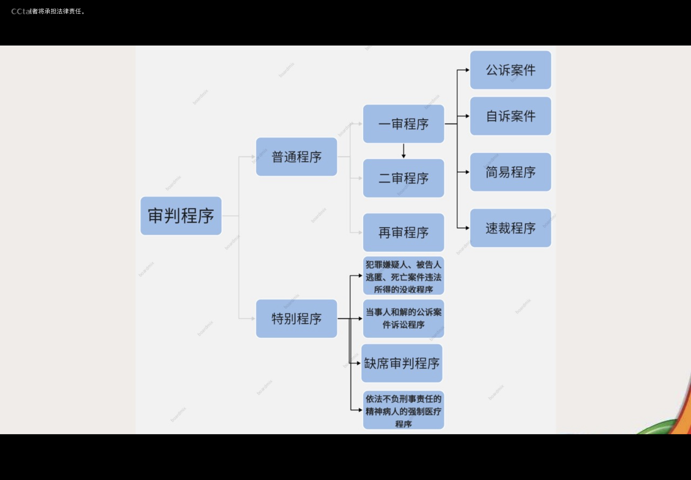

---
tags:
  - 刑事诉讼法
---
# 刑事诉讼法的基本原理和基本原则
## 刑事诉讼法的任务和基本原则
- 中华人民共和国刑事诉讼法的任务，是保证准确、及时地查明犯罪事实，正确应用法律，惩罚犯罪分子，保障无罪的人不受刑事追究，教育公民自觉遵守法律，积极同犯罪行为作斗争，维护社会主义法制，尊重和保障人权，保护公民的人身权利、财产权利、民主权利和其他权利，保障社会主义建设事业的顺利进行。
## 刑事诉讼法的基本原则
1. 侦查权、检察权、审判权由专门机关依法行使与严格遵守法定程序
    - 对刑事案件的侦查、拘留、执行逮捕、预申，由公安机关负责。检察、批准逮捕、检察机关直接受理的案件的侦查、提起公诉，由人民检察院负责。审判由人民法院负责。除法律特别规定的以外，其他任何机关、团体和个人都无权行使这些权力。
    - 国家安全机关依照法律规定，办理危害国家安全的刑事案件，行使与公安机关相同的职权。
    - 军队保卫部门对军队内部发生的刑事案件行使侦查权。
2. 人民法院、人民检察院依法独立行使职权
    - 人民法院依照法律规定独立行使审判权，人民检察院依照法律规定独立行使检察权，不受行政机关、社会团体和个人的干涉

-tx-
|:---|:---
|独立的主体|法院、检察院：主体是机关而非个人|
|独立的根据|严格依照法律|
|独立的对象|1.独立于行政机关、社会团体和个人；2.不独立于党、人大、人民、社会的领导、监督|
|独立的方式|1.组织关系方面：（1）检察院，领导与被领导，检察系统整体独立（2）法院，监督与被监督，以具体法院为单位独立（2）具体办案方面：强调谁办案谁负责|
|独立的理论|1.国外：三权分立体制，司法独立原则——（1）机关独立；（2）法官独立；2.我国：整体独立意义上的司法独立——机关独立|

3. 分工负责，互相配合，互相制约
    - 人民法院、人民检察院和公安机关进行刑事诉讼，应当分工负责，互相配合，互相制约，以保证准确有效地执行法律。（《刑事诉讼法》 第七条）
4. 人民检察院依法对刑事诉讼实行法律监督
    - 人民检察院依法对刑事诉讼实行法律监督。（《刑事诉讼法》第八条)
5. 犯罪嫌疑人、被告人有权获得辦护
    - 人民法院审判案件，除本法另有规定的以外，一律公开进行。被告人有杈获得辦护，人民法院有义务保证被告人获得辦护。（《刑事诉讼法》第十一条)
    - 公、检、法三机关有义务保障，告知义务，提供进行辦护的条件
6.未经人民法院依法判决，对任何人都不得确定有罪

-tx-
|:---|:---
|含义|①确定被告人有罪的权力由人食法院统一行使，其他任何机关、团体和个人都无权行使②人民法院的判决必须依法作出|
|体现|1.区分犯罪嫌疑人和被告人 （以提起公诉为界限）；②明确由控诉方负被告人有罪的举证责任，被告人不负证明自己无罪的义务③疑案作无罪处理：证据不足不起诉(审查起诉阶段）或者无罪判决（第一审阶段）
|注意|无罪推定原则的基本含义是，任何人，在末经依法确定有罪以前，应假定其无罪。|

7. 保障诉讼参与人的诉讼权利
    - 人民法院、人民检察院和公安机关应当保障犯罪嫌疑人、被告人和其他诉讼参与人依法享有的辩护权和其他诉讼权利。诉讼参与人对于申判人员、检察人员和侦查人员侵犯公民诉讼权利和人身侮辱的行为，有权提出控告。（《刑事诉讼法》第14条）
8. 具有法定情形不予追究刑事責任
    - 有下列情形之一的，不追究刑事责任，已经追究的，应当撤销案件，或者不起诉，或者终止审理，或者宣告无罪：
        - 一）情节显著轻微、危害不大，不认为是犯罪的;
        - (二)犯罪已过追诉时效期限的；
        - 三)经特赦令免除刑罚的;
        - (四)依照刑法告诉才处理的犯罪，没有告诉或者撤回告诉的;
        - (五)犯罪嫌疑人、被告人死亡的;
        - 六)其他法律规定免予追究刑事责任的。
9. 追究外国人刑事责任适用我国刑事诉讼法
    - 刑事诉讼法第17条规定了这一原则：1．对于外国人犯罪应当追究刑事责任的，适用我国刑事诉讼法；2．对于享有外交特权和豁免权的外国人犯罪应当追究刑事责任的，通过外交途径解决。国际法中有关于享有外交特杈和豁免权的外国人的内容。
10. 认罪认罚从宽制度
    - 犯罪嫌疑人、被告人自愿如实供述自己的罪行，承认指控的犯罪事实愿意接受处罚的，可以依法从宽处理
# 管辖与回避制度
## [管 辖](《刑事诉讼法》#第二章%20管%20辖)
### 立案管辖

-tx-
|:---|:---
|公安机关|刑事案件的侦查由公安机关进行，法律另有规定的除外|
|检察院|人民检察院在对诉讼活动实行法律监督中发现的**司法工作人员利用职权实施的非法拘禁、刑讯逼供、非法搜查等侵犯公民权利、损害司法公正的犯罪**，可以由人民检察院立案侦查。对于公安机关管辖的国家机关工作人员利用职权实施的重大犯罪案件，需要由人民检察院直接受理的时候，经**省级以上人民检察院**决定，可以由人民检察院立案侦查。|
|法院|自诉案件|

- 自诉案件
    - 告诉才处理的案件、
        - 亲告罪
            - 侮辱罪、诽谤罪（但是严重危害社会秩序和国家利益的除外）
            - 暴力干涉婚姻自由罪（致使被害人死亡的除外）
            - 虐待罪（致使被害人重伤、死亡的除外）
            - 侵占罪（绝对亲告罪）
    - 被害人有证据证明的轻微刑事案件
    - 被害人有证据证明对被告人侵犯自己人身、财产权利的行为应当依法追究刑事责任，而公安机关或者人民检察院不予追究被告人刑事责任的案件（《刑事诉讼法》第二百一十条）
### 级别管辖

-tx-
|:---|:---
|基层人民法院|基层人民法院管辖第一审普通刑事案件，但是依照本法由上级人民法院管辖的除外。|
|中级人民法院|中级人民法院管辖下列第一审刑事業件：（一)危害国家安会、恐怖活动業件：（二)可能判处无期花刑、死刑的崇件；（三）没收违法所得的申请，由犯罪地或者犯罪嫌嶷人．被告人居任地的中级人民法院组成合议庭进行审理。（《刑事诉钴法》 第二百九十六条）|
|高级人民法院|高级人民法院管辖的第一审刑事業件，是全省(自治区、直辖市）性的重大刑事業件。|
|最高人民法院|最高人民法院管辖的第一审刑事業件，是会国性的重大刑事案件。|

- 上级人民法院在必要的时候，可以审判下级人民法院管辖的第一审刑事案件；下级人民法院认为案情重大、复杂需要由上级人民法院审判的第一审刑事案件，可以请求移送上一级人民法院审判（《刑事诉讼法》第二十四条）
### 地域管辖
^26f48c
- 原则：刑事案件由犯罪地的人民法院管辖。如果由被告人居住地的人民法院审判更为合适的，可以由被告人居住地的人民法院管辖
- 犯罪地管辖为主，居住地管辖为辅
- **犯罪地包括犯罪行为发生地和犯罪结果发生地**
- 几个同级人民法院都有权管辖的案件，由最初受理的人民法院审判。在必要的时候，可以移送主要犯罪地的人民法院审判
- 上级人民法院可以指定下级人民法院**审判管辖**不明的案件，也可以指定下级人民法院将案件移送其他人民法院审判
## 回避
1. 刑事诉讼法规定回避情形（《刑事诉讼法》第二十九条）
    - 审判人员、检察人员、侦查人员有下列情形之一的，应当自行回避，当事人及其法定代理人也有权要求他们回避（既可口头也可书面）
    1. 是本案当事人或者是当事人的近亲属
    2. 本人或者他的近亲属和本案有利害关系的
    3. 担任过本案的证人、鉴定人、辩护人、诉讼代理人
    4. 与本案当事人有其他关系，可能影响公正处理案件的
- 回避主体除此之外还包括书记员、鉴定人和翻译人员，但是证人、律师不适用回避
2. 决定权限
    - 审判人员、检察人员、侦查人员的回避，应当分别由院长、检察长、公安机关负责人决定
    - 院长的回避，由本院审判委员会决定；检察长和公安机关负责人的回避，由同级人民检察院检察委员会决定
3. 回避程序
    - 对侦查人员的回避作出决定前，侦查人员不能停止对案件的侦查（审查回避程序期间其他程序原则上停止，但侦查程序不停止）
    - 对驳回申请回避的决定，当事人及其法定代理人可以申请复议一次（没有复核）
    - 辩护人、诉讼代理人可以依照法律规定要求回避、申请复议
# 辩护与代理制度
## 辩护
1. 概念
    - 辩护，是指辩方针对控方对犯罪嫌疑人、被告人的指控，从实体和程序上提出有利于犯罪嫌疑人、被告人的事实和理由，以维护犯罪嫌疑人、被告人合法权益的诉讼活动。辩方与控诉相对应，是刑事诉讼中的一种防御性的诉讼活动
    - 辩护人是指接受犯罪嫌疑人、被告人的委托或人民法院的指定，帮助犯罪嫌疑人、被告人行使辩护权，以维护其合法权益的人
2. 辩护人的人数和范围
    - 犯罪嫌疑人、被告人除自己行使辩护权以外，还可以委托一至二人作为辩护人。下列的人可以被委托为辩护人
        - 律师
        - 人民团体或者犯罪嫌疑人、被告人所在单位推荐的人
        - 犯罪嫌疑人、被告人的监护人、亲友
3. 委托辩护人的时间
    - 犯罪嫌疑人自被**侦查机关第一次讯问**或者**采取强制措施之日**起，有权委托辨护人;在**侦查期间**，只能委托**律师**作为辦护人。
    - **被告人有权随时委托辩护人（自诉案件）。**
    - 告知义务：侦查机关在第一次讯问犯罪嫌疑人或者对犯罪嫌疑人采取强制措施的时候，应当告知犯罪嫌疑人有权委托辨护人。人民检察院自收到移送审查起诉的案件材料之日起三日以内，应当告知犯罪嫌疑人有权委托辦护人。人民法院自受理案件之日起三日以内，应当告知被告人有权委托辨护人。犯罪嫌疑人、被告人在押期间要求委托辩护人的，人民法院、人民检察院和公安机关应当及时转达其要求。犯罪嫌疑人、被告人在押的，也可以由其监护人、近亲属代为委托辦护人。（代为委托权）
### 特殊人群未委托辩护人

-tx-
|:---|:---
|犯罪嫌疑人、被告人因经济困难或者其他原因没有委托辩护人的|本人及其近亲属可以向法律援助机构提出申请。对符合法律援助条件的，法律援助机构应当指派律师为其提供辩护|
|犯罪嫌疑人、被告人是盲、聋、哑人，或者是尚未完全丧失辨认或者控制自己行为能力的精神病人，未成年人，没有委托辩护人的|人民法院、人民检察院和公安机关应当通知法律援助机构指派律师为其提供辩护|
|犯罪嫌疑人、被告人可能判处无期徒刑、死刑，没有委托辩护人的|人民法院、人民检察院和公安机关应当通知法律援助机构指派律师为其提供辩护|

- 2018年新修订《刑事诉讼法》新增”值班律师制度“
    - 法律援助机构可以在人民法院、看守所等场所派驻值班律师。犯罪嫌疑人、被告人没有委托辨护人，法律援助机构没有指派律师为其提供辦护的，由值班律师为犯罪嫌疑人、被告人提供法律咨询、程序选择建议、申请变更强制措施、对案件处理提出意见等法律帮助。
    - 人民法院、人民检察院、看守所应当告知犯罪嫌疑人、被告人有权约见值班律师，并为犯罪嫌疑人、被告人约见值班律师提供便利

### 辩护律师

-tx-
|:---|:---
|侦查阶段|辩护律师在侦查期间可以为犯罪嫌疑人提供法律帮助;代理申诉、控告;申请变更强制措施;向侦查机关了解犯罪嫌疑人涉嫌的罪名和案件有关情况，提出意贝。辩护律师可以回在押的犯罪嫌疑人， 被告人会见和通信。辦护律师会见在押的犯罪嫌疑人、被告人，可以了解案件有关情况，提供法律咨询等。|
|审查起诉阶段|⑨自案件移送审查起诉之日起，可以向犯罪嫌疑人、被告人核实有关证据 ②**辩护律师**自人民检察院对案件审查起诉之日起，可以查阅、摘抄、复制**本案的案卷材料**。**其他辩护人**经人民法院、人民检察院**许可**，也可查阅、摘抄、复制上述材料。|
#### 律师会见当事人
- 辩护律师持律师执业证书、律师事务所证明和委托书或者法律援助公函要求会见在押的犯罪嫌疑人、被告人的，看守所应当及时安排会见，至迟不得超过四十八小时。
- 危害国家安全犯罪、恐怖活动犯罪案件，在侦查期间辩护律师会见在押的犯罪嫌疑人，应当经侦查机关许可。上述案件，侦查机关应当事先通知看守所。
- 辩护律师会见犯罪嫌疑人、被告人时不被监听。
#### 调取证据
1. 辩护人认为在侦查、审查起诉期间公安机关、人民检察院收集的证明犯罪嫌疑人、被告人无罪或者罪轻的证据材料末提交的，有权申请人民检察院、人民法院调取；
2. 辩护人收集的有关犯罪嫌疑人不在犯罪现场、未达到刑事责任年龄、属于依法不负刑事责任的精神病人的证据，应当及时告知公安机关、人民检杂院;
3. 辩护律师经证人或者其他有关单位和个人同意，可以向他们收集与本案有关的材料，也可以申请人民检察院、人民法院收集、调取证据，或者申请人民法院通知证人出庭作证；
4. 辩护律师经人民检察院或者人民法院许可，并日经被害人或者其近亲属、被害人提供的证人同意，可以向他们收集与本案有关的材料。
#### 律师非独立上诉权
- 经被告人同意，提出上诉的权利
#### 律师保密权
- 辩护律师对在执业活动中知悉的委托人的有关情况和信息，**有权予以保密**。**但是**，辩护律师在执业活动中**知悉委托人或者其他人，准备或者正在实施危害国家安全、公共安全以及严重危害他人人身安全的犯罪的**，应当及时告知司法机关
## 委托诉讼代理人
- 公诉案件的被害人及其法定代理人或者近亲属，附近民事诉讼的当事人及其法定代理人，自**案件移送审查起诉之日起**，有权委托诉讼代理人
- 自诉案件的自诉人及其法定代理人，附带民事诉讼的当事人及其法定代理人，**有权随时委托诉讼代理人**
# 刑事证据
##  证据概述
1. 法定证据种类
    - 可以用于证明案件事实的材料，都是证据。
    - 证据包括：
        - (一)物证;
        - （二)书证;
        - （三)证人证言
        - （四)被害人陈述
        - (五)犯罪嫌疑人、被告人供述和辦解
        - (六)鉴定意见;
        - （七)勘验、检查、辨认、侦查实验等笔录;
        - （八)视听资料、电子数据。
- 证据必须经过查证属实，才能作为定案的根据。
## 附带民事诉讼
- 被害人因人身权利受到犯罪侵犯或者财物被犯罪分子段坏而遭受物质损失的，有权在刑事诉公过程中提起附带民事诉讼;被害人死亡或者丧失行为能力的，其法定代理人、近亲属有权提起附带民事诉讼。【可以提起附带民事诉讼情形】
- 因受到犯罪侵犯，提起附带民事诉讼或者单独提起民事诉讼要求赔偿精神损失的，人民法院不予受理。
- 被告人非法占有、处置被害人财产的，应当依法予以追缴或者责令退赔。被害人提起附带民事诉讼的，人民法院不子受理。追缴、退赔的情况，可以作为量刑情节考虑。
- 国家机关工作人员在行使职权时，侵犯他人人身、财产权利构成犯罪，被害人或者其法定代理人、近亲属提起附带民事诉讼的，人民法院不予受理，但应当告知其可以依法申请国家赔偿。
- 国家财产、集体财产遭受损失，受损失的单位未提起附带民事诉讼，人民检察院在提起公诉时提起附带民事诉讼的，人民法院应 当受理。人民检察院提起附带民事诉讼的，应当列为附带民事诉公原告人。
- 侦查、申查起诉期间，有权提起附带民事诉讼的人提出赔偿要求，经公安机关、人民检察院调解，当事人双方已经达成协议并全部覆行，被害人或者其法定代理人、近亲属又提起附带民事诉讼的，人民法院不予受理，但有证据证明调解违反自愿合法原则的除外。【公安机关、检察院刑事调解协议效力】
# 提起公诉
- 审查起诉主体
    - 凡需要提起公诉的案件，一律由人民检察院审查决定
- 监察委侦查案件
    - 人民检察院对于监察机关移送起诉的案件，依照本法和监察法的有关规定进行审查。人民检察院经审查，认为需要补充核实的，应当退回监察机关补充调查，必要时可以自行补充侦查。对于监察机关移送起诉的已采取留置措施的案件，人民检察院应当对犯罪嫌疑人先行拘留，留置措施自动解除。人民检察院应当在拘留后的十日以内作出是否逮捕、取保候审或者监视居住的决定。特殊情况下，决定的时间可以延长一日至四日。人民检察院决定采取强制措施的期间不计入审查起诉期限
- 审查起诉条件
    1. 犯罪事实、情节是否清楚，证据是否确实、充分，犯罪性质和罪名的认定是否正确
    2. 有无遗漏罪行和其他应当追究刑事责任的人
    3. 是否属于不应追究刑事责任的
    4. 有无附带民事诉讼
    5. 侦查活动是够合法
- 审查起诉期限
    - 人民检察院对于监察机关、公安机关移送起诉的案件，应当在一个月内作出决定，重大、复杂的案件，可以延长十五日；犯罪嫌疑人认罪认罚，符合素菜程序适用条件的，应当在十日以内作出决定，对可能判处的有期徒刑超过一年的，可以延长十五日。（10到15日）
    - 人民检察院审查起诉的案件，改变管辖的，从改变后的人民检察院收到案件之日起计算审查起诉期限
- 认罪认罚
    - 犯罪嫌疑人自愿认罪，同意量刑建议和程序使用的，应当在辩护人或者值班律师在场的情况下签署认罪认罚具结书。犯罪嫌疑人认罪认罚，有下列情形之一的，不需要签署认罪认罚具结书：
        1. 犯罪嫌疑人是盲、聋、哑人，或者是尚未完全丧失辨认或者控制自己行为能力的精神病人
        2. 未成年犯罪嫌疑人的法定代理人、辩护人对未成年人认罪认罚有异议的
        3. 其他不需要签署认罪认罚具结书的情形
- 补充侦查
    - 人民检察院审查案件，对于需要补充侦查的，可以退回公安机关补充侦查，也可以自行侦查
    - 对于补充侦查的案件，应当在一个月内补充侦查完毕。补充侦查以二次为限。补充侦查完毕移送人民检察院后，人民检察院重新计算审查起诉期限。对于二次补充侦查的案件，人民检察院仍认为证据不足，不符合起诉条件的，应当作出不起诉的决定
## 决定不服的起诉
1. 公安机关
    - 对对于公安机关移送起诉的案件，人民检察院决定不起诉的，应当将不起诉决定书送达公安机关。公安机关认为不起诉的决定有错误的时候，可以要求复议，如果意见不被接受，可以向上一级人民检察院提请复核。
2. 被害人
    - 对于有被害人的案件，决定不起诉的，人民检察院应 当将不起诉决定书送达被害人。被害人如果不服，可以自收到决定书后七日以内向上一级人民检察院申诉，请求提起公诉。人民检察院应当将复查决定告知被害人。对人民检察院维持不起诉決定的，被害人可以向人民法院起诉。被害人也可以不经申诉，直接向人民法院起诉。人民法院受理案件后，人民检察院应当将有关案件材料移送人民法院。
3. 被不起诉人
    - 对于人民检察院依照本法第一百七十七条第二款规定作出的不起诉決定，被不起诉人如果不服，可以自收到决定书后七日以内向人民检察院申诉。人民检察院应当作出复查决定，通知被不起诉的人，同时抄送公安机关。
# 刑事追究时效
- 犯罪经过下列期限不再追诉：
    1. 法定最高刑为不满五年有期徒刑的，经过五年;
    2. 法定最高刑为五年以上不满十年有期徒刑的，经过十年;
    3. 法定最高刑为十年以上有期徒刑的，经过十五年;
    4. 法定最高刑为无期徒刑、死刑的，经过二十年。如果二十年以后认为必须追诉的，须报请最高人民检察院核准
## 追究时效计算
- 在人民检察院、公安机关、国家安全机关立案侦查或者在人民法院受理案件以后，逃避侦查或者审判的，不受追溯期限的限制
- 被害人在追诉期限内提出控告，人民法院、人民检察院、公安机关应当立案而不予立案的，不受追诉期限的限制
- 追诉期限从犯罪之日起计算；犯罪行为有连续或者连续状态的，从犯罪行为终了之日起计算。在追诉期限以内由犯罪的，前罪追诉的期限从犯后罪之日起计算

# 审判程序
## 第一审程序
- 公开审理：人民法院审判第一审案件应当公开进行。但是有关**国家秘密**或者**个人隐私**的案件，不公开申理;涉及**商业秘密**的案件，当事人**申请不公开审理**的，可以不公开审理。
- 不公开审理的案件，应当当庭宣布不公开审理的理由。**宣告判决，一律公开进行**。
- 期限：人民法院申理公诉案件，应当在受理后**二个月**以内宣判，至迟不得超过三个月。对于可能判处死刑的案件或者附带民事诉讼的案件，以及有本法第一百五十八条规定情形之一的，经上一级人民法院批准，可以延长**三个月**;因特殊情况还需要延长的，报请最高人民法院批准。
- 人民法院改变管辖的案件，从改变后的人民法院收到案件之日起计算南理期限。
- 人民检察院补充侦查的案件，补充侦查完毕移送人民法院后，人民法院重新计算审理期限。
## 自诉案件程序
1. 人民法院对于自诉案件进行审查后，按照下列情形分别处理：
    - (一)犯罪事实清楚，有足够证据的案件，应当开庭审判;
    - (二)缺三罪证的白诉案件，如果白诉人提不出补充证据，应当说服自诉人撤回白诉，或者裁定驳回。
- 自诉人经两次依法传唤，无正当理由拒不到庭的，或者未经法庭许可中途退庭的，按撤诉处理。
2. 调解：人民法院对自诉案件，可以进行**调解**;自诉人在宣告判决前，可以同被告人自行和解或者撤回自诉。本法第二百一十条第三项规定的案件【被害人有证据证明对被告人侵犯白己人身、财产权利的行为应当依法追究刑事责任，而公安机关或者人民检察院不予追究被告人刑事责任的案件】不适用调解。
3. 期限：人民法院审理白诉案件的期限，被告人被羁押的，适用本法第二百零八条第一款【公诉案件期限】、第二款的规定;未被羁押的，应当在受理后**六个月**以内宣判。
## 简易程序
1. 适用情形
    - **基层人民法院**管辖的案件，符合下列条件的，可以适用简易程序审判：
        - （一)案件事实清楚、证据充分的；
        - (二)被告人承认自己所犯罪行，对指控的犯罪事实没有异议的;
        - 三)被告人对适用简易程序没有异议的。
    - 人民检察院在提起公诉的时候，可以建议人民法院适用简易程序。
2. 不适用简易程序情形
    - 有下列情形之一的，不适用简易程序：
        - （一)被告人是盲、聋、哑人，或者是尚末完全丧失辨认或者控制自己行为能力的精神病人
        - （二）有重大社会影响的；
        - (三)共同犯罪案件中部分被告人不认罪或者对适用简易程序有异议的;
        - 四)其他不宜适用简易程序申理的。
3. 审判组织
    - 适用简易程序审理案件，对可能判处三年有期徒刑以下刑罚的，可以组成合议庭进行审判，也可以由审判员一人独任南判;对可能判处的有期徒刑超过三年的，应当组成合议庭进行审判。适用简易程序审理公诉案件，人民检察院应当派员出席法庭。
## 速裁程序
1. 适用案件类型
    - 基层人民法院管辖的可能判处三年有期徒刑以下刑罚的案件，案件事实清楚，证据确实、充分，被告人认罪认罚并同意适用速裁程序的，可以适用速裁程序，由审判员一人独任审判。人民检察院在提起公诉的时侯，可以建议人民法院适用速裁程序。
2. 不适用情形
    - 有下列情形之一的，不适用速裁程序：
        - （一被告人是盲、聋、 哑人，或者是尚未完全丧失辨认或者控制自己行为能力的精神病人的;
        - （二)被告人是未成年人的;
        - (三)案件有重大社会影响的;
        - (四)共同犯罪案件中部分被告人对指控的犯罪事实、罪名、量刑建议或者适用速裁程序有异议的;
        - （五)被告人与被害人或者其法定代理人没有就附带民事诉讼赔偿等事项达成调解或者和解协议的;
        - 六)其他不宜适用速裁程序审理的。
3. 适用速裁程序申理案件，应当当庭宣判。
## 二审程序
1. 被告人、自诉人**上诉**权
    - 被告人、自诉人和他们的法定代理人，不服地方各级人民法院第一审的判决、裁定，有权用书状或者口头向上一级人民法院上诉。被告人的辩护人和近亲属，经被告人同意，可以提出上诉。
    - 附带民事诉讼的当事人和他们的法定代理人，可以对地方各级人民法院第一审的判决、裁定中的附带民事诉讼部分，提出上诉。
    - 对被告人的上诉权，不得以任何借口加以剥夺。
2. 检察院抗诉杈
    - 地方各级人民检察院认为本级人民法院第一审的判决、裁定确有错误的时候，应当向上一级人民法院提出**抗诉**。
3. 被害人上诉
    - 被害人及其法定代理人不服地方各级人民法院第一审的判决的，自收到判決书后五日以内，有权请求人民检察院提出抗诉。人民检察院自收到被害人及其法定代理人的请求后五日以内，应当作出是否抗诉的决定并且答复请求人。（被告人没有上诉权）
4. 期限
    - 不服**判决**的上诉和抗诉的期限为**十日**，不服**裁定**的上诉和抗诉的期限为五日，从接到判决书、裁定书的第二日起算。
5. 第二审的判决、裁定和最高人民法院的判决、裁定，都是终申的判决、裁定。
## 当事人和解的公诉案件诉讼程序
1. 适用案件
    - 下列公诉案件，犯罪嫌疑人、被告人真诚悔罪，通过向被害人赔偿损失、赔礼道歉等方式获得被害人谅解，被害人自愿和解的，双方当事人可以和解：
        - 一)因民间纠纷引起，涉嫌刑法分则第四章、第五章规定的犯罪案件，可能判处三年有期徒刑以下刑罚的;
        - 二)除渎职犯罪以外的可能判处七年有期徒刑以下刑罚的过失犯罪案件。
    - 犯罪嫌疑人、被告人在五年以内曾经故意犯罪的，不适用本章规定的程序。
2. 程序
    - 双方当事人和解的，**公安机关**、**人民检察院**、**人民法院**应当听取当事人和其他有关人员的意见，对和解的自愿性、合法性进行审查，并主持制作和解协议书。
    - 对于达成和解协议的案件，**公安机关可以向人民检察院提出从宽处理的建议**。人民检察院可以向人民法院提出从宽处罚的建议;对于犯罪情节轻微，不需要判处刑罚的，可以作出不起诉的决定。人民法院可以依法对被告人从宽处罚。
## 缺席审判程序(2018年刑事诉讼法新增）
1. 适用案件类型
    - 对于**贪污贿赂犯罪案件**，以及需要及时进行申判，经最高人民检察院核准的严重**危害国家安全犯罪恐怖活动犯罪案件**，犯罪嫌疑人、被告人在境外，监察机关公安机关移送起诉，人民检察院认为犯罪事实已经查清，证据确实、充分，依法应当追究刑事责任的，可以向人民法院提起公诉。人民法院进行审查后，对于起诉书中有明确的指控犯罪事实，符合缺席审判程序适用条件的，应当決定**开庭审判**。
2. 管辖法院
    - 由犯罪地、被告人离境前居住地或者最高人民法院指定的中级人民法院组成**合议庭**进行审理。
3. 开庭前程序（送达）
    - 人民法院应当通过有关国际条约规定的或者外交途径提出的司法协助方式，或者被告人所在地法律允许的其他方式，将传票和人民检察院的起诉书副本送达被告人。
    - 传票和起诉书副本送达后，被告人未按要求到案的，人民法院应 当开庭审理，依法作出判決，并对违法所得及其他涉案财产作出处理。
4. 辩护情形
    - 人民法院缺席审判案件，被告人有权委托辦护人，被告人的近亲属可以**代为委托辨护人**。被告人及其近亲属没有委托辦护人的，人民法院**应当通知法律援助机构指派律师**为其提供辦护。
5. 不服判决上诉和抗诉
    - 人民法院应当将判决书送达被告人及其近亲属、辦护人。**被告人或者其近亲属不服判决的**，有权向上一级人民法院上诉。**辦护人经被告人或者其近亲属同意**，可以提出上诉。
    - 人民检察院认为人民法院的判决确有错误的，应当向上级人民法院提出抗诉。
6. 到案后情形
    - 在审理过程中，被告人白动投案或者被抓获的，人民法院应当重新审理。
    - 罪犯在判决、裁定发生法律效力后到案的，人民法院应当将罪犯交付执行刑罚。交付执行刑罚前，人民法院应当告知罪犯有权对判决、裁定提出异议。罪犯对判决裁定**提出异议的**，人民法院应当重新申理。
    - 依照生效判决、裁定对罪犯的财产进行的处理确有错误的，应当予以返还、赔偿。
7. 无法出庭缺席审判情形
    - 因被告人患有严重疾病无法出庭，中止审理**超过六个月**，被告人仍无法出庭，被告人及其法定代理人、近亲属**申请或者同意恢复审理**的，人民法院可以在被告人不出庭的情况下缺席申理，依法作出判决。被告人死亡的，人民法院应当裁定终止审理，但有证据证明被告人无罪，人民法院经缺席审理确认无罪的，应当依法作出判決。
8. 被告人死亡缺席审判情形
    - 人民法院按照申判监督程序重新审判的案件，被告人死亡的，人民法院可以缺席审理，依法作出判决。